# Model-Lightweight
> * survey&amp;research on future work

* 作为首个综合实力匹敌Meta的Llama3.1-405B的国产开源大模型，DeepSeek-V3创新性地同时使用了FP8、MLA和MoE三种技术手段。
> * (deepseek fp8)
> 据悉，**FP8**是一种新的数值表示方式，用于深度学习的计算加速。相比传统的FP32和FP16，FP8进一步压缩了数据位数，极大地提升了硬件计算效率。虽然FP8是由英伟达提出的技术，但DeepSeek-V3是全球首家在超大规模模型上验证了其有效性的模型。这一技术（FP8）至少将显存消耗降低了30%。(deepseek fp8)
>
>* 相较于其他模型使用的MoE模型，DeepSeek-V3使用的**MoE模型**更为精简有效。该架构使用更具细粒度的专家并将一些专家隔离为共享专家，使得每次只需要占用很小比例的子集专家参数就可以完成计算.DeepSeek的MoE是一个突破性的MoE语言模型架构，它通过创新策略，包括细粒度专家细分和共享专家隔离，实现了比现有MoE架构更高的专家专业化和性能。
>
> * MLA（多头潜在注意力）机制，**MLA**被引入DeepSeek-V2中，并帮助将KV-cache的内存减少了93.3%。完全由DeepSeek团队自主提出，并最早作为核心机制引入了DeepSeek-V2模型上，极大地降低了缓存使用。

* 大模型轻量化技术目标：预训练语言模型利用轻量化技术压缩后体积更小，跑得更快。

* 大模型可轻量化的方向：
  

    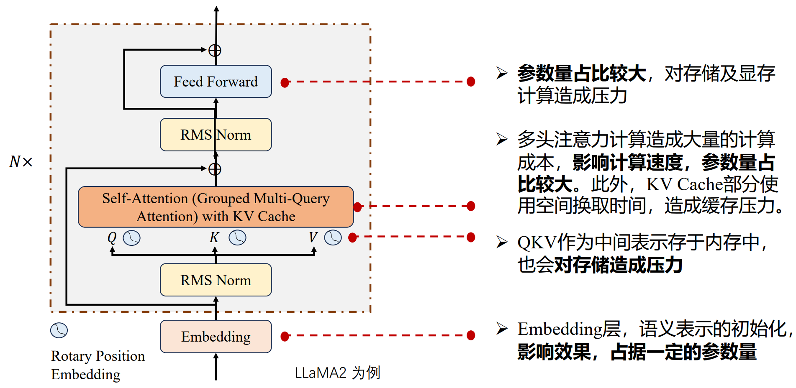
  

* 轻量化的优化目标：
  * 降低参数数量
  * 减少占用存储空间大小
  * 降低浮点运算数（FLOPs）
  * 减轻硬件压力
>    * 显存（GPU Memory）用于存储训练、推理中的模型参数、梯度和激活值
>         - 减少显存占用可降低对显卡设备的要求，增加训练批次大小，减少训练时间
>    * 带宽（Bandwidth）代表数据在处理器和内存之间的传输速度
>         - 降低带宽占用可以减少因数据传输带来的延迟，提高计算速度。
>    * 内存（RAM）用于存储训练数据、模型参数和中间计算结果
>         - 降低内存空间需求可以减少磁盘交换操作，提升训练效率。

* 轻量化模型评估指标：
  - 参数压缩比（Compression Rate）: 轻量化后模型的参数占原始参数的比例
  - 内存占用（Memory Footprint）：模型在运行过程中占用的内存大小。较小的内存占用有助于在内存受限的设备上高效运行模型。
  - 吞吐量（Throughput）：单位时间内模型输出token的数量。高吞吐量表示模型能够更高效地处理大批量数据,适用于需要高处理能力的应用。
    

    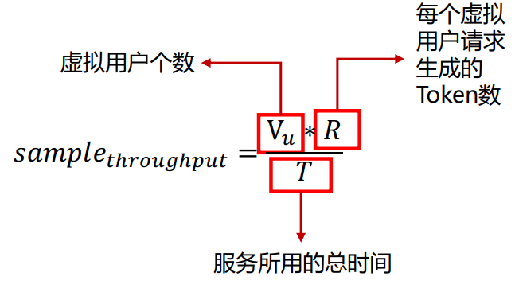
  

  
  - 推理速度（Inference Speed）：模型每次推理所需的时间，通常以毫秒（ms）为单位。高推理速度对于实时应用和用户体验非常重要。
  - 延迟（Latency）模型从接收到输入到输出结果所需的时间。低延迟对于实时应用（如语音识别、自动驾驶）尤为重要。在LLM推理中，计算公式如下：

    

    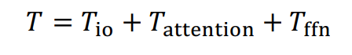
  

    

    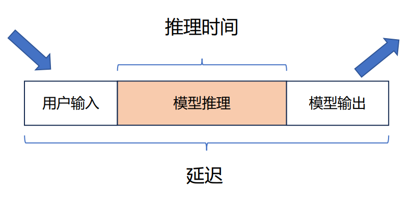
  

  - 推理效果（performance）压缩后模型在各类任务上的表现，如精准度（ACC），困惑度（PPL）, BLEU值等。
  
  | 指标 | 适用任务 | 说明 |
  | --- | --- | --- |
  | ACC | 分类任务 | 准确率（Accuracy），衡量模型正确预测的样本占总样本的比例 |
  | PPL | 生成任务 | 困惑度（Perplexity），衡量语言模型预测下一个词的不确定性，值越低表示模型预测能力越强。 |
  | BLEU | 机器翻译、文本生成 | 双语评估的不确定性（Bilingual Evaluation Understudy），用于评估机器翻译或文本生成任务的质量。 |
  | F1 | 分类任务 | F1分数是精确率和召回率的调和平均数，用于衡量不平衡数据集上的分类性能。 |
  | EM | 信息抽取 | 精确匹配（Exact Match），用于评估信息抽取任务中模型输出与真实标签的完全一致 |

---

## 轻量化技术详解

### 分类：
  

    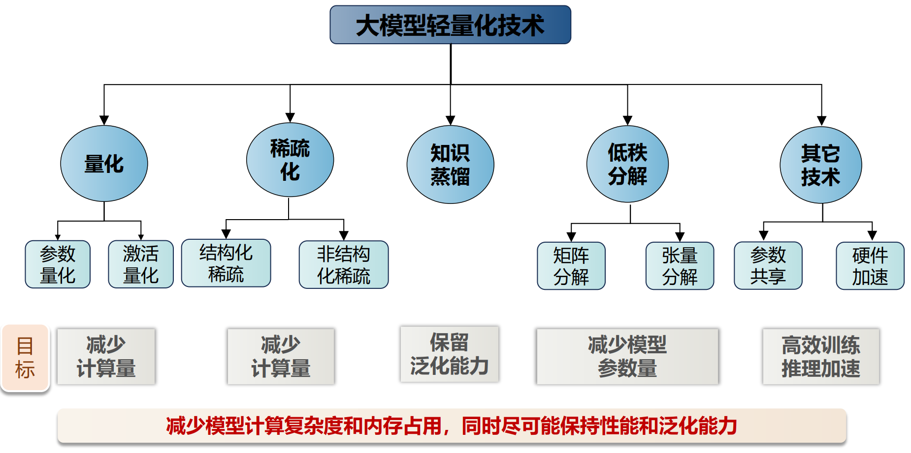
  

### 量化技术
> 大模型量化是一种将深度学习模型的参数从高精度（16位浮点数，FP16）转换为低精度（如8位整数，INT8）的方法.[(deepseek fp8)](#jump1) 

* 量化过程：  

以INT8对称量化为例，在存储权重参数时，将16位浮点数组成的矩阵$W^{FP16}$经量化存储为8位整数矩阵为$W^{INT8}$：

$$
W^{INT8} = \text{round}\left(\frac{W^{FP16}}{\text{scale}}\right)
$$

其中，$\text{round}()$为近似取整函数，$\text{scale}$为缩放因子：

$$
\text{scale} = \frac{\max\limits_{i,j} \left| w_{i,j} \right|}{127}
$$

$W^{INT8}$内所有值均为$[-127, 127]$内的整数。

  

    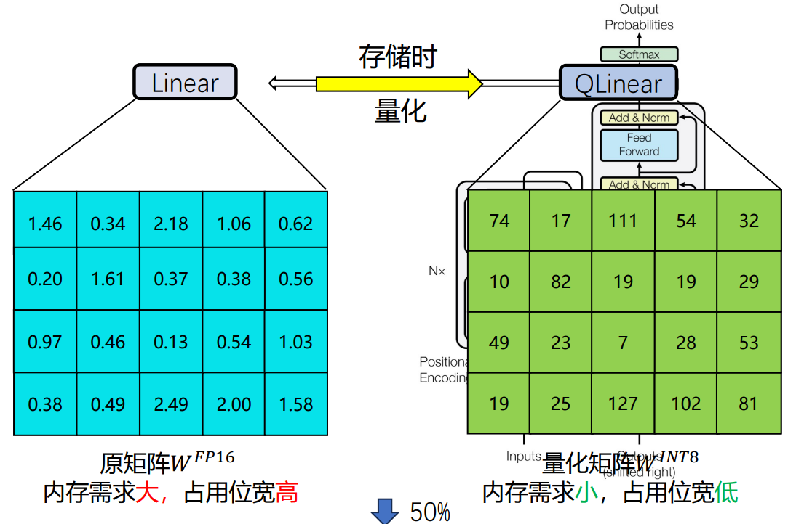
  

* 解量化过程

  在推理时，为了恢复近似的原始浮点数值，需要进行解量化，即将量化后的整数矩阵 $W^{INT8}$ 映射回浮点数矩阵 $\tilde{W}^{FP16}$：

  $$
  \tilde{W}^{FP16} = W^{INT8} \cdot \text{scale}
  $$

  解量化后的矩阵 $\tilde{W}^{FP16}$ 相对于原矩阵 $W^{FP16}$ 有一定的误差，使用的比特数（bits）越多，误差越小。

  

    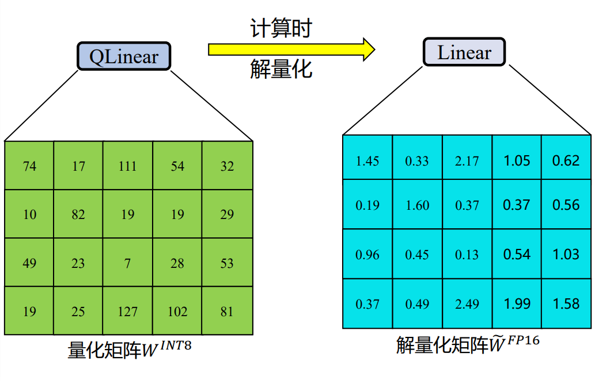
  

* 低比特量化的难点

> 当大模型参数量大于6.7B时，经激活层生成的矩阵X存在占总参数量0.1%的异常值（outlier），这些异常值导致量化时矩阵一部分正常值被量化为零（如中间示例图标红部分），严重影响量化大模型的性能。

  

    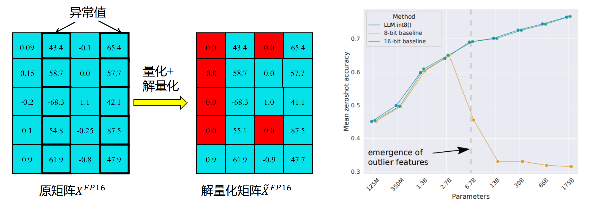
  

  * 实例
#### LLM.int8()解决方案
LLM.int8() 采用混合精度量化的方法，保持X矩阵内的异常值为16位浮点数（FP16）且不参与量化，X其余的参数正常量化，取得了很好的效果。

  

    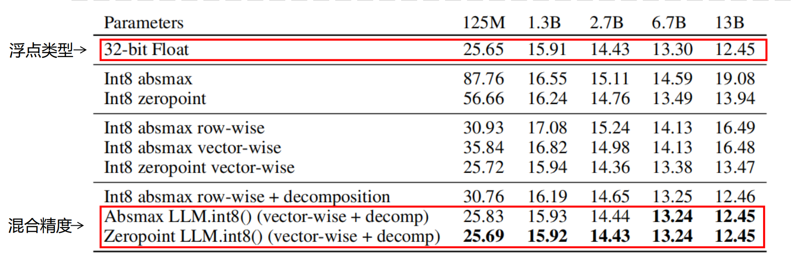
  

> Q：混合精度在实际应用中难以部署

#### SmoothQuant: 缓解异常值的影响
a. Original
  

    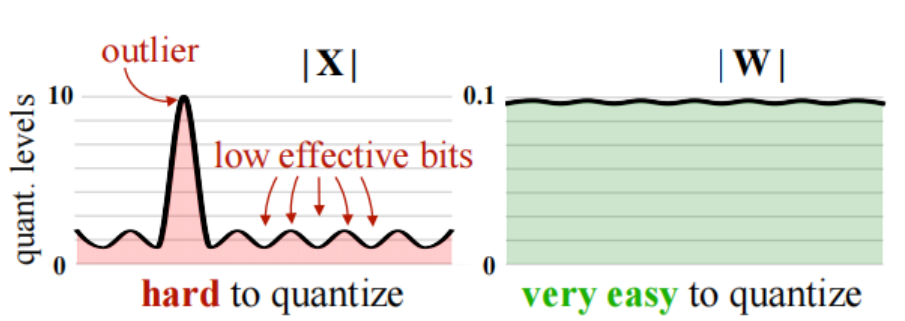
  

普通量化方法为直接对W和X分别做量化，由于异常值的存在，X难以被高精度量化：

  $$
  Y=X.W
  $$

b. SmmothQuant
  

    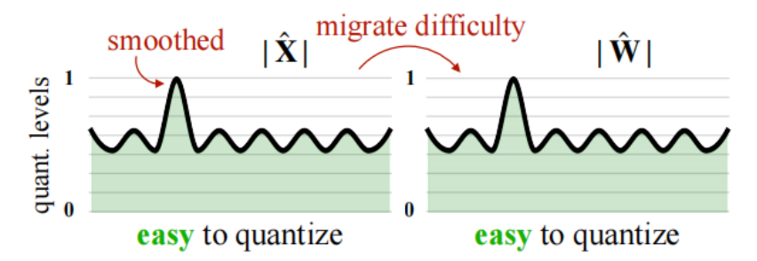
  

SmoothQuant方法利用W矩阵的参数分布均匀，无异常值的特点，从数学等价的角度出发，令W矩阵“代偿”一部分异常值的影响，实现了W和X的高精度INT8量化：

$$
Y = (X \cdot \text{diag}(s)^{-1}) \cdot (\text{diag}(s) \cdot W) = \hat{X} \hat{W}
$$

$$
s_j = \frac{\max(|X_j|)^\alpha}{\max(|W_j|)^{1-\alpha}}
$$

* 业界常用的量化工具

1. 通用

* 训练后量化 ● SmoothQuant ● AWQ ● OmniQuant ● Squeeze LLM
* 量化感知训练 ● LLM-QAT ● QLoRA ● TensorRT-LLM

2. 端侧

* TinyChat ● GPTQ  ● llama.cpp

---

### 稀疏化技术

* 参数稀疏化
1. 背景
  
  随着模型参数量的增大，训练一个巨大的生成式模型，需要很大的GPU内存，并且产生巨大的计算量。大模型稀疏化通过减少**参数的密集度**来加快计算速度和减少存储成本

2. 基本思想
>   
>    * 非结构化稀疏
>     寻找一种方法来确定模型中**哪些参数对模型的输出贡献较小或不重要**，然后将这些参数设置为零或进行其他形式的删减。这样可以在保持模型性能的前提下，大幅减少模型的参数数量。
>   
>   

>     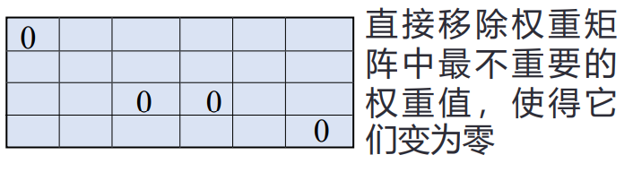
>   

>   
>   * 结构化稀疏
>     
>     基于结构式的稀疏策略对参数进行剪枝或置零，以充分利用参数的稀疏性来加速计算过程。例如，在矩阵乘法等运算中，跳过零值参数的计算，从而提高计算效率。
>   

>     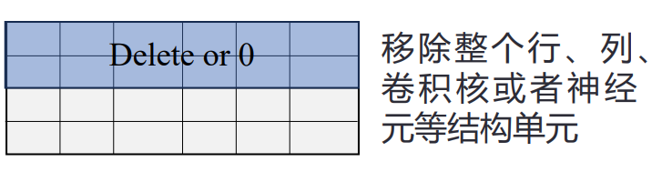
>   

* 应用 

1.稀疏激活：
> 可以在激活函数层面上引入稀疏性，例如使用ReLU激活函数自然产生的零值。

  

    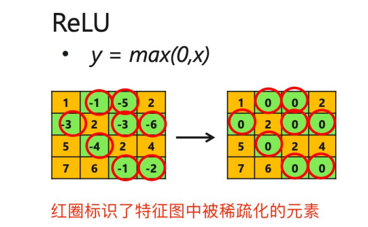
  

2.稀疏注意力机制：
> 稀疏注意力机制通过限制注意力计算的范围，减少了不必要的计算。例如，使用局部注意力或分块稀疏注意力来降低计算量。

  

    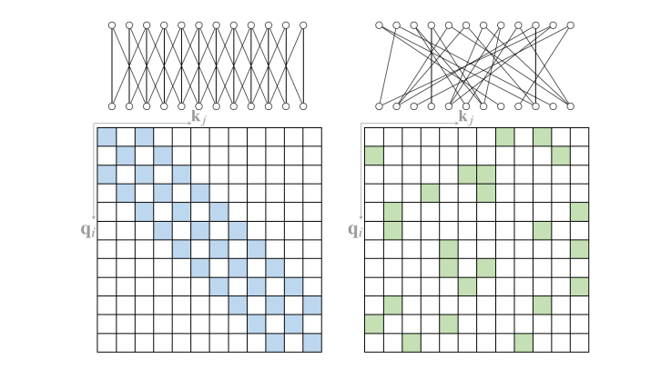
  

  
* 非结构化稀疏

>**好处**：
>>结构化稀疏由于限制了剪枝元素的选择自由，会导致模型准确率的大幅下降，而采用非结构化稀疏则可以较好的保留模型的准确率。

>**问题1**：
>> 由于GPU中的张量核专门设计用于加速稠密矩阵乘法计算的专用单元，对非结构化稀疏矩阵乘法计算的效
>> 率较低，因此会造成模型推理速度的大幅下降。
>
>发展方向：
>> 在使用非结构化稀疏的同时，保持较高的模型推理速度。
>
>解决1：
>> 针对非结构化稀疏矩阵乘法较慢的问题，Flash-LLM提出将稀疏矩阵转化为密集矩阵，每次进行
>> 计算前都将稀疏矩阵转化为这种稠密格式
>
>  

>    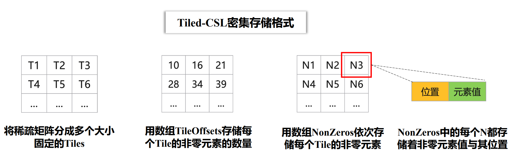
>  

>**问题2**：
>> 张量核进行计算前，需要进行矩阵数据加载，而加载时张量核空闲，造成了核使用率低
>
>解决2：
>>Flash-LLM提出了一种**双缓冲计算重叠的计算流水线**。
>>>计算重叠：可以看出每次迭代时，都会在一个缓冲区加载数据，另一个缓冲区计算矩阵乘法。
>>  

>>    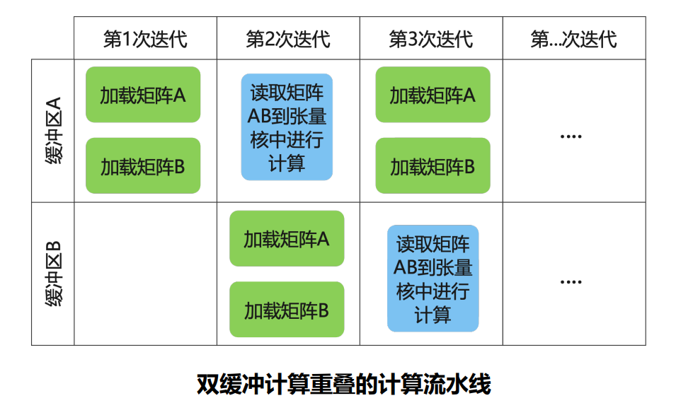
>>  

>>
>>**优势**:采用这种新的流水线进行计算能够减少GPU的空闲时间。有效提升了模型推理的效率。

* Flash-LLM性能比较
 

   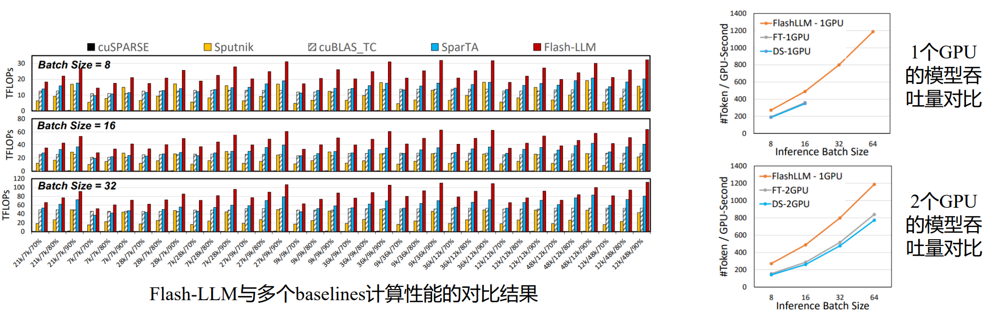
 

> Flash-LLM在非结构化稀疏矩阵乘法的性能方面具有显著优势，能够更好地支持大规模生成模型的推理。

---

### 知识蒸馏

* 基础理论
> 知识蒸馏（Knowledge Distillation）旨在将知识从大型复杂模型（教师模型）转移到更小更简单的模型（学生模型），使得学生模型能够在性能上接近教师模型，同时具有较少的计算资源需求，从而实现模型压缩。

> 知识蒸馏的核心公式为蒸馏损失函数：
> 
> $$L = \alpha L_{CE} + (1 - \alpha) L_{KD}$$
> 
> 其中：
> - $L$是总损失。
> - $L_{CE}$是学生模型的交叉熵损失。
> - $L_{KD}$ 是学生模型与教师模型软标签之间的蒸馏损失。
> - $\alpha$ 是权重系数，用于平衡两种损失。

* 大语言模型的知识蒸馏
> 大语言模型上的知识蒸馏工作可以划分为两类，黑盒知识蒸馏和白盒知识蒸馏。

**黑盒知识蒸馏**

* 黑盒（Black-Box）知识蒸馏中，学生模型只能访问教师模型的输出（**闭源大模型**），而无法直接访问教师模型的内部结构、参数或中间层的激活值。

* 黑盒知识蒸馏又分为“**思维链蒸馏**”、“上下文学习蒸馏”以及“指令遵循蒸馏”三种方法。

**白盒知识蒸馏**

* 白盒（White-Box）知识蒸馏中，学生模型不仅可以访问教师模型的输出，还可以访问教师模型的内部结构、参数和中间层的激活值（**开源大模型**）。

* 学生模型可以直接学习教师模型的**中间层特征**或特定参数，从而获得更丰富的知识。

**前向KL散度（Forward KLD）**

标准知识蒸馏中的前向KL散度（Forward KLD）会迫使学生模型试图覆盖教师模型的所有细节信息，即使那些细节对任务并不重要。
> 不实际，小模型的能力有限，这会导致资源浪费的同时，使得学生模型在真正重要的部分表现不佳。

 

   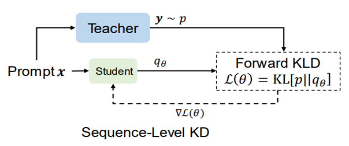
 

**反向KL散度（Reverse KLD）**

反向KL散度（Reverse KLD）选择从学生模型中采样学习样本$y$，允许学生模型可以结合自身学习能力的同时，从教师模型中学习对于学生模型最重要的知识.
> 避免资源的浪费，从而在关键任务上表现更好。

 

   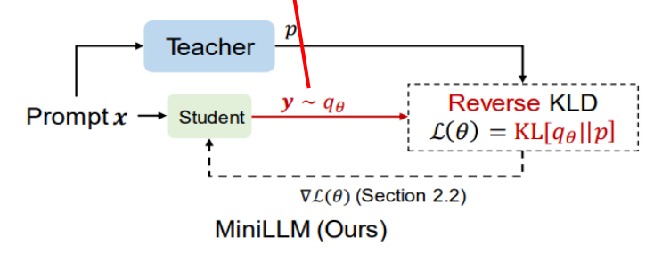
 

 **改进学习优化算法**

* **单步分解**：将每步的生成质量从损失的梯度中单独提出来，以减少训练时的方差并加速收敛，提升单步生成质量。

* **教师指导的采样**：在采样时混合教师和学生模型的分布。

* **长度正则化**：当前的损失容易导致蒸馏后的模型产生较短的序列，因此增加了一个正则化到损失函数中，以避免KL散度的累积值过小。

$$
\nabla \mathcal{L}(\theta) = - \underset{y \sim p_{\theta}}{\mathbb{E}} \left[ \sum_{t=1}^{T} w_t \left( \nabla \sum_{y' \in V} q_{\theta}(y' | y_{<t}, x) \log \frac{p(y' | y_{<t}, x)}{q_{\theta}(y' | y_{<t}, x)} + R_{t+1}^{\text{Norm}} \nabla q_{\theta}(y_t | y_{<t}, x) \right) \right]
$$

其中：
- $\nabla \mathcal{L}(\theta)$ 表示损失函数的梯度。
- $y \sim p_{\theta}$ 表示从模型分布中采样。
- $w_t$ 是时间步 $t$ 的权重。
- $q_{\theta}(y' | y_{<t}, x)$ 是学生模型的概率分布。
- $p(y' | y_{<t}, x)$ 是教师模型的概率分布。
- $R_{t+1}^{\text{Norm}}$ 是正则化项。
- $V$ 是词汇表。

公式分为两部分：
- $\nabla \mathcal{L}_{\text{single-part}}$：单步部分，计算每个时间步的损失。
- $\nabla \mathcal{L}_{\text{Norm-long part}}$：正则化长序列部分，调整序列长度的影响。
