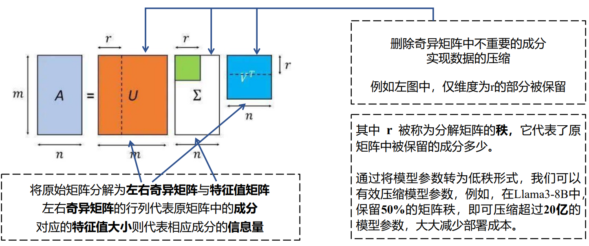
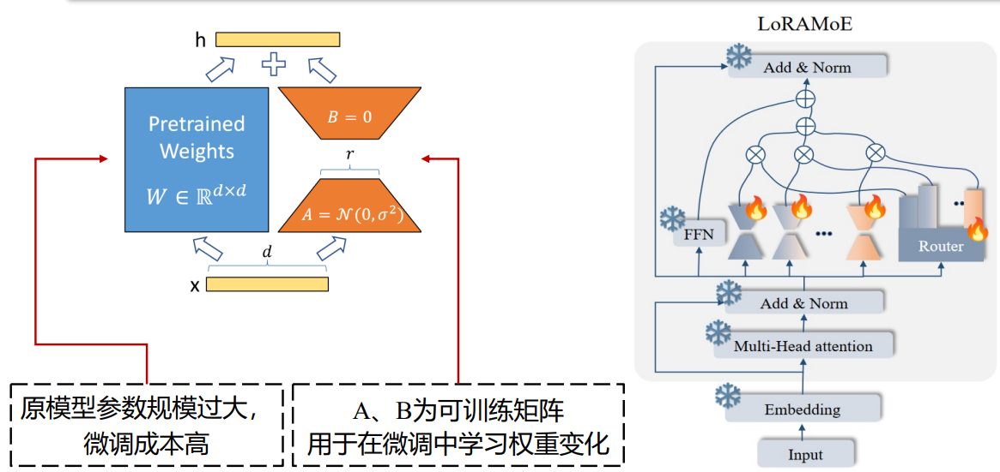
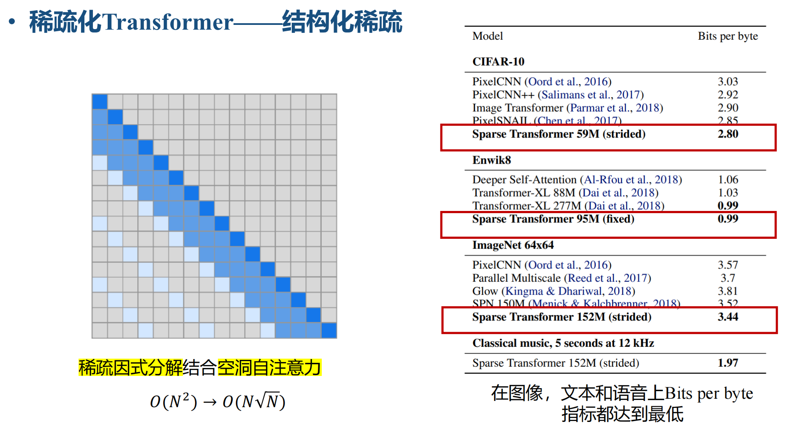
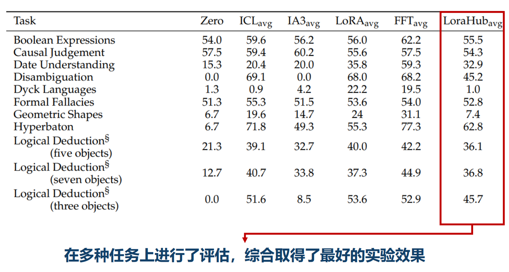

# Model-Lightweight
> * survey&amp;research on future work

* 作为首个综合实力匹敌Meta的Llama3.1-405B的国产开源大模型，DeepSeek-V3创新性地同时使用了FP8、MLA和MoE三种技术手段。
> * <span id="jump1">(deepseek fp8)</span>
> 据悉，**FP8**是一种新的数值表示方式，用于深度学习的计算加速。相比传统的FP32和FP16，FP8进一步压缩了数据位数，极大地提升了硬件计算效率。虽然FP8是由英伟达提出的技术，但DeepSeek-V3是全球首家在超大规模模型上验证了其有效性的模型。这一技术（FP8）至少将显存消耗降低了30%。<span id="jump1">(deepseek fp8)</span>
>
>* 相较于其他模型使用的MoE模型，DeepSeek-V3使用的**MoE模型**<span id="jump2">(deepseek MoE)</span>更为精简有效。该架构使用更具细粒度的专家并将一些专家隔离为共享专家，使得每次只需要占用很小比例的子集专家参数就可以完成计算.DeepSeek的MoE是一个突破性的MoE语言模型架构，它通过创新策略，包括细粒度专家细分和共享专家隔离，实现了比现有MoE架构更高的专家专业化和性能。
>
> * MLA（多头潜在注意力）机制，**MLA**被引入DeepSeek-V2中，并帮助将KV-cache的内存减少了93.3%。完全由DeepSeek团队自主提出，并最早作为核心机制引入了DeepSeek-V2模型上，极大地降低了缓存使用。

* 大模型轻量化技术目标：预训练语言模型利用轻量化技术压缩后体积更小，跑得更快。

* 大模型可轻量化的方向：
  <div align="center">
    
  </div>

* 轻量化的优化目标：
  * 降低参数数量
  * 减少占用存储空间大小
  * 降低浮点运算数（FLOPs）
  * 减轻硬件压力
>    * 显存（GPU Memory）用于存储训练、推理中的模型参数、梯度和激活值
>         - 减少显存占用可降低对显卡设备的要求，增加训练批次大小，减少训练时间
>    * 带宽（Bandwidth）代表数据在处理器和内存之间的传输速度
>         - 降低带宽占用可以减少因数据传输带来的延迟，提高计算速度。
>    * 内存（RAM）用于存储训练数据、模型参数和中间计算结果
>         - 降低内存空间需求可以减少磁盘交换操作，提升训练效率。


* 轻量化模型评估指标：
  - 参数压缩比（Compression Rate）: 轻量化后模型的参数占原始参数的比例
  - 内存占用（Memory Footprint）：模型在运行过程中占用的内存大小。较小的内存占用有助于在内存受限的设备上高效运行模型。
  - 吞吐量（Throughput）：单位时间内模型输出token的数量。高吞吐量表示模型能够更高效地处理大批量数据,适用于需要高处理能力的应用。
    <div align="center">
    
  </div>
  
  - 推理速度（Inference Speed）：模型每次推理所需的时间，通常以毫秒（ms）为单位。高推理速度对于实时应用和用户体验非常重要。
  - 延迟（Latency）模型从接收到输入到输出结果所需的时间。低延迟对于实时应用（如语音识别、自动驾驶）尤为重要。在LLM推理中，计算公式如下：

    <div align="center">
    
  </div>
    <div align="center">
    
  </div>

  - 推理效果（performance）压缩后模型在各类任务上的表现，如精准度（ACC），困惑度（PPL）, BLEU值等。
  
  | 指标 | 适用任务 | 说明 |
  | --- | --- | --- |
  | ACC | 分类任务 | 准确率（Accuracy），衡量模型正确预测的样本占总样本的比例 |
  | PPL | 生成任务 | 困惑度（Perplexity），衡量语言模型预测下一个词的不确定性，值越低表示模型预测能力越强。 |
  | BLEU | 机器翻译、文本生成 | 双语评估的不确定性（Bilingual Evaluation Understudy），用于评估机器翻译或文本生成任务的质量。 |
  | F1 | 分类任务 | F1分数是精确率和召回率的调和平均数，用于衡量不平衡数据集上的分类性能。 |
  | EM | 信息抽取 | 精确匹配（Exact Match），用于评估信息抽取任务中模型输出与真实标签的完全一致 |

---

## 轻量化技术详解

### 分类：
  <div align="center">
    
  </div>

### 量化技术
> 大模型量化是一种将深度学习模型的参数从高精度（16位浮点数，FP16）转换为低精度（如8位整数，INT8）的方法.[(deepseek fp8)](#jump1) 

* 量化过程：  

以INT8对称量化为例，在存储权重参数时，将16位浮点数组成的矩阵$W^{FP16}$经量化存储为8位整数矩阵为$W^{INT8}$：

$$
W^{INT8} = \text{round}\left(\frac{W^{FP16}}{\text{scale}}\right)
$$

其中，$\text{round}()$为近似取整函数，$\text{scale}$为缩放因子：

$$
\text{scale} = \frac{\max\limits_{i,j} \left| w_{i,j} \right|}{127}
$$

$W^{INT8}$内所有值均为$[-127, 127]$内的整数。

  <div align="center">
    
  </div>

* 解量化过程

  在推理时，为了恢复近似的原始浮点数值，需要进行解量化，即将量化后的整数矩阵 $W^{INT8}$ 映射回浮点数矩阵 $\tilde{W}^{FP16}$：

  $$
  \tilde{W}^{FP16} = W^{INT8} \cdot \text{scale}
  $$

  解量化后的矩阵 $\tilde{W}^{FP16}$ 相对于原矩阵 $W^{FP16}$ 有一定的误差，使用的比特数（bits）越多，误差越小。

  <div align="center">
    
  </div>

* 低比特量化的难点

> 当大模型参数量大于6.7B时，经激活层生成的矩阵X存在占总参数量0.1%的异常值（outlier），这些异常值导致量化时矩阵一部分正常值被量化为零（如中间示例图标红部分），严重影响量化大模型的性能。

  <div align="center">
    
  </div>

  * 实例
#### LLM.int8()解决方案
LLM.int8() 采用混合精度量化的方法，保持X矩阵内的异常值为16位浮点数（FP16）且不参与量化，X其余的参数正常量化，取得了很好的效果。

  <div align="center">
    
  </div>

> Q：混合精度在实际应用中难以部署

#### SmoothQuant: 缓解异常值的影响
a. Original
  <div align="center">
    
  </div>

普通量化方法为直接对W和X分别做量化，由于异常值的存在，X难以被高精度量化：

  $$
  Y=X.W
  $$

b. SmmothQuant
  <div align="center">
    
  </div>
SmoothQuant方法利用W矩阵的参数分布均匀，无异常值的特点，从数学等价的角度出发，令W矩阵“代偿”一部分异常值的影响，实现了W和X的高精度INT8量化：

$$
Y = (X \cdot \text{diag}(s)^{-1}) \cdot (\text{diag}(s) \cdot W) = \hat{X} \hat{W}
$$

$$
s_j = \frac{\max(|X_j|)^\alpha}{\max(|W_j|)^{1-\alpha}}
$$

* 业界常用的量化工具

1. 通用

* 训练后量化 ● SmoothQuant ● AWQ ● OmniQuant ● Squeeze LLM
* 量化感知训练 ● LLM-QAT ● QLoRA ● TensorRT-LLM

2. 端侧

* TinyChat ● GPTQ  ● llama.cpp

---

### 稀疏化技术

* 参数稀疏化
1. 背景
  
  随着模型参数量的增大，训练一个巨大的生成式模型，需要很大的GPU内存，并且产生巨大的计算量。大模型稀疏化通过减少**参数的密集度**来加快计算速度和减少存储成本

2. 基本思想
>   
>    * 非结构化稀疏
>     寻找一种方法来确定模型中**哪些参数对模型的输出贡献较小或不重要**，然后将这些参数设置为零或进行其他形式的删减。这样可以在保持模型性能的前提下，大幅减少模型的参数数量。
>   
>   <div align="center">
>     
>   </div>
>   
>   * 结构化稀疏
>     
>     基于结构式的稀疏策略对参数进行剪枝或置零，以充分利用参数的稀疏性来加速计算过程。例如，在矩阵乘法等运算中，跳过零值参数的计算，从而提高计算效率。
>   <div align="center">
>     
>   </div>

* 应用 

1.稀疏激活：
> 可以在激活函数层面上引入稀疏性，例如使用ReLU激活函数自然产生的零值。

  <div align="center">
    
  </div>

2.稀疏注意力机制：
> 稀疏注意力机制通过限制注意力计算的范围，减少了不必要的计算。例如，使用局部注意力或分块稀疏注意力来降低计算量。

  <div align="center">
    
  </div>
  
* 非结构化稀疏

>**好处**：
>>结构化稀疏由于限制了剪枝元素的选择自由，会导致模型准确率的大幅下降，而采用非结构化稀疏则可以较好的保留模型的准确率。

>**问题1**：
>> 由于GPU中的张量核专门设计用于加速稠密矩阵乘法计算的专用单元，对非结构化稀疏矩阵乘法计算的效
>> 率较低，因此会造成模型推理速度的大幅下降。
>
>发展方向：
>> 在使用非结构化稀疏的同时，保持较高的模型推理速度。
>
>解决1：
>> 针对非结构化稀疏矩阵乘法较慢的问题，Flash-LLM提出将稀疏矩阵转化为密集矩阵，每次进行
>> 计算前都将稀疏矩阵转化为这种稠密格式
>
>  <div align="center">
>    
>  </div>


>**问题2**：
>> 张量核进行计算前，需要进行矩阵数据加载，而加载时张量核空闲，造成了核使用率低
>
>解决2：
>>Flash-LLM提出了一种**双缓冲计算重叠的计算流水线**。
>>>计算重叠：可以看出每次迭代时，都会在一个缓冲区加载数据，另一个缓冲区计算矩阵乘法。
>>  <div align="center">
>>    
>>  </div>
>>
>>**优势**:采用这种新的流水线进行计算能够减少GPU的空闲时间。有效提升了模型推理的效率。

* Flash-LLM性能比较
 <div align="center">
   
 </div>

> Flash-LLM在非结构化稀疏矩阵乘法的性能方面具有显著优势，能够更好地支持大规模生成模型的推理。

---

### 知识蒸馏

* 基础理论
> 知识蒸馏（Knowledge Distillation）旨在将知识从大型复杂模型（教师模型）转移到更小更简单的模型（学生模型），使得学生模型能够在性能上接近教师模型，同时具有较少的计算资源需求，从而实现模型压缩。

> 知识蒸馏的核心公式为蒸馏损失函数：
> 
> $$L = \alpha L_{CE} + (1 - \alpha) L_{KD}$$
> 
> 其中：
> - $L$是总损失。
> - $L_{CE}$是学生模型的交叉熵损失。
> - $L_{KD}$ 是学生模型与教师模型软标签之间的蒸馏损失。
> - $\alpha$ 是权重系数，用于平衡两种损失。


* 大语言模型的知识蒸馏
> 大语言模型上的知识蒸馏工作可以划分为两类，黑盒知识蒸馏和白盒知识蒸馏。

**黑盒知识蒸馏**

* 黑盒（Black-Box）知识蒸馏中，学生模型只能访问教师模型的输出（**闭源大模型**），而无法直接访问教师模型的内部结构、参数或中间层的激活值。

* 黑盒知识蒸馏又分为“**思维链蒸馏**”、“上下文学习蒸馏”以及“指令遵循蒸馏”三种方法。

**白盒知识蒸馏**

* 白盒（White-Box）知识蒸馏中，学生模型不仅可以访问教师模型的输出，还可以访问教师模型的内部结构、参数和中间层的激活值（**开源大模型**）。

* 学生模型可以直接学习教师模型的**中间层特征**或特定参数，从而获得更丰富的知识。

**前向KL散度（Forward KLD）**

标准知识蒸馏中的前向KL散度（Forward KLD）会迫使学生模型试图覆盖教师模型的所有细节信息，即使那些细节对任务并不重要。
> 不实际，小模型的能力有限，这会导致资源浪费的同时，使得学生模型在真正重要的部分表现不佳。

 <div align="center">
   
 </div>

**反向KL散度（Reverse KLD）**

反向KL散度（Reverse KLD）选择从学生模型中采样学习样本$y$，允许学生模型可以结合自身学习能力的同时，从教师模型中学习对于学生模型最重要的知识.
> 避免资源的浪费，从而在关键任务上表现更好。

 <div align="center">
   
 </div>

 **改进学习优化算法**

* **单步分解**：将每步的生成质量从损失的梯度中单独提出来，以减少训练时的方差并加速收敛，提升单步生成质量。

* **教师指导的采样**：在采样时混合教师和学生模型的分布。

* **长度正则化**：当前的损失容易导致蒸馏后的模型产生较短的序列，因此增加了一个正则化到损失函数中，以避免KL散度的累积值过小。

$$
\nabla \mathcal{L}(\theta) = - \mathbb{E}_{y \sim p_{\theta}} \left[ \sum_{t=1}^{T} w_t \left( \nabla \left( \sum_{y' \in V} q_{\theta}(y' | y_{<t}, x) \log \frac{p(y' | y_{<t}, x)}{q_{\theta}(y' | y_{<t}, x)} \right) + R_{t+1}^{\text{Norm}} \nabla q_{\theta}(y_t | y_{<t}, x) \right) \right]
$$

 <div align="center">
   
 </div>

其中：
- $\nabla \mathcal{L}(\theta)$ 表示损失函数的梯度。
- $y \sim p_{\theta}$ 表示从模型分布中采样。
- $w_t$ 是时间步 $t$ 的权重。
- $q_{\theta}(y' | y_{<t}, x)$ 是学生模型的概率分布。
- $p(y' | y_{<t}, x)$ 是教师模型的概率分布。
- $R_{t+1}^{\text{Norm}}$ 是正则化项。
- $V$ 是词汇表。

公式分为两部分：
- $\nabla \mathcal{L}_{\text{single-part}}$：单步部分，计算每个时间步的损失。
- $\nabla \mathcal{L}_{\text{Norm-long part}}$：正则化长序列部分，调整序列长度的影响。

**MiniLLM方法在不同体量大模型上的实验结果**

* 与其他知识蒸馏方法相比，MiniLLM方法学到了三种教师大模型更多的知识，性能表现更优。

* MiniLLM方法在各种小规模的学生模型上达到超越原教师模型的性能。

 <div align="center">
   
 </div>

> *表示学生模型性能超越了教师模型。可以用一半的参数达到原本的性能，实验效果优于其他蒸馏方法。


### 低秩分解


 <div align="center">
   
 </div>


* 经典分解理论：PCA分解

 <div align="center">
   
 </div>

* 经典分解理论：SVD分解

 <div align="center">
   
 </div>

* 适应大模型：张量分解技术（分解结构更为复杂的大模型参数）

> * Tucker分解
> 可以被视作一种高阶PCA. 将张量分解为核心张量在每个mode上与矩阵的乘积
> 
>  <div align="center">
>    
>  </div>
> 
> * Tensor Train分解
> 将一个N阶张量分解成了2个二阶张量和N-2个三阶张量的乘积
> 
> 
>  <div align="center">
>    
>  </div>


### 混合张量分解技术

> 在大模型中，张量分解转为以可训练参数的形式存在，形成张量网络，让端到端训练成为可能

 <div align="center">
   
 </div>

> 单独的低秩分解技术存在模型**参数规模**、**计算速度**、以及**预测效果**平衡问题

 <div align="center">
   
 </div>

* 通过将矩阵分解和张量火车分解（Tensor Train, TT）结合，平衡Transformer模型推理速度，预测效果和参数规模的平衡问题

 <div align="center">
   
 </div>

* Hypoformer方法在Transformer模型上推理速度、预测效果以及参数规模的实验结果分析 

 <div align="center">
   
 </div>

### 语素增强的低秩近似技术

* 通过语素词嵌入的低秩近似解决原始词向量矩阵的参数量巨大问题
  
  1.Transformer语言模型词向量参数量分析
  
  * 单词量（大）: $|V|$ 可达到数万甚至数十万
  * 维度（大）: $d$ 通常为512、768、1024
  * 词嵌入矩阵（大）: $|V|$ ×$d$
  * 通过**形态素分割**和**张量积**实现的单词嵌入压缩
    * 单词维度 >> 形态素维度
    * 单词数量 >> 形态素数 

  <div align="center">
    
  </div>

  2.传统基于张量积进行embedding压缩

 <div align="center">
   
 </div>


* MorphTE方法在词嵌入矩阵模块上的计算与实验分析
  
 <div align="center">
   
 </div>

> 通过少数量的、低维的语素向量替代原始的词向量表示矩阵，保持了模型性能，从而减少模型参数


* LORA: LOW-RANK ADAPTATION 
> 冻结模型原参数，仅使用可训练的低秩分解矩阵进行模型高效微调

 <div align="center">
   
 </div>

> LoRA已经成为大模型时代最常用的模型微调方式，有充分的研究价值。例如，近期的研究将LoRA与MoE[(deepseek MoE)](#jump2)架构结合，使一部分LoRA专注于利用世界知识来解决下游任务，以减轻世界知识边缘遗忘。

### 参数共享

* 背景
> **Q:** MHA(Multi-head Attention)中，每个“头”都需要独立工作，这就需要很多资源（计算量和内存）。当头数很多时，这会变得很麻烦，就像请了很多朋友参加聚会，每个人都要吃饭，费用自然很高。

 <div align="center">
   
 </div>

> **A**：多个查询头（Query）共享相同的键（Key）和值（Value）矩阵。就像让几个朋友共同用同一个资源，不用每个人都从头开始找。这种共享资源的方式大大减少了需要处理的内容，从而节省了资源。

 <div align="center">
   
 </div>

* 优点：减少了计算的复杂度和内存的占用，可以让模型运行得更快，占用更少的资源

* MQA和GQA在不同数据集上推理速度、预测效果的实验结果分析

 <div align="center">
   
 </div>

### 结合硬件特点的技术

* Flash Attention
  - 减少存取操作次数：
  
    减少语言模型自回归计算过程对HBM(内存)访问次数，充分利用SRAM内存，通过**融合计算**，实现一次存取，加速运算；

 <div align="center">
   
 </div>

  - 分块优化计算：

    优化Softmax归一化计算步骤，通过对注意力计算过程中的**K和V矩阵进行分块**，解决超出SRAM缓存问题

 <div align="center">
   
 </div>


* **并行解码策略**可减少7.2%的推理时间，提升吞吐量，不影响模型效果

 <div align="center">
   
 </div>

> 递归解码阶段，可以将Detokenize和下一个token的Computing计算在CPU和GPU上**并行计算**，掩盖
掉前面生成单词的Detokenize的时间


### 各类轻量化方法总结

#### 从以下多个角度评价

| 压缩方案 | 最低压缩率 | 是否需要额外训练 | 可否自由控制压缩粒度 | 可优化结构 | 可否加速 | 模型效果 | 可否联合使用 |
| --- | --- | --- | --- | --- | --- | --- | --- |
| 量化 | 32倍 | 通常不需要 | 否 | 全部参数 | 是 | 位宽低时显著变差 | 是 |
| 稀疏化 | 自适应 | 是 | 是 | 全部参数 | 是 | 稀疏率变大时显著变差 | 是 |
| 知识蒸馏 | 自适应 | 是 | 是 | 全部参数 | 是 | 属于辅助增强算法 | 是 |
| 参数共享 | 有限 | 通常不需要 | 是 | 层级结构&块状结构 | 否 | 多层共享效果显著变差 | 是 |
| 低秩分解 | 自适应 | 是 | 是 | 全部参数 | 一些低阶的分解方案可加速 | 效果保持能力较强 | 是 |


---


## 大语言模型轻量化技术的未来展望

### 量子计算


---


## 研究方向


  <div align="center">
    
  </div>

> Transformer稀疏化的更关注什么？
>   - 主要关注**预训练**阶段的稀疏化
>   - 更关注参数与**训练速度**
> 
> 生成式大模型稀疏化的更关注什么？
>   - 主要普遍行业更关注**微调与推理**的计算成本
>   - 更关注吞吐量、带宽及显存等受限的成本


  <div align="center">
    
  </div>


> * 可以看到在Transformer组件上的稀疏化工作大多是需要再次进行训练，在超大模型规模下，这种稀疏成本是难以让人接受的。
> * 如何将现有方法与大模型解耦，类似于控制器的学习改装为LoRA的形式，减少稀疏化技术实现本身的时间成本，也是大模型稀疏化主要关注的问题。


**transformer方向**

* 多种技术组合
  
  1. 利用稀疏化技术进行低秩逼近（稀疏化+低秩分解）
    
> **稀疏化技术：** 为了优化计算和降低计算复杂度，稀疏化技术通过将注意力矩阵中的一部分元素置为零，从而减少需要计算的部分。这可以通过稀疏矩阵的形式存储和计算，只保留对模型有意义的关系（例如，只保留相邻词汇之间的高权重注意力）。这样，矩阵不再是一个完全的密集矩阵，而是变为一个稀疏矩阵。

> **低秩逼近：** 低秩逼近是通过对原始矩阵进行矩阵分解（如奇异值分解 SVD 或其他方法），将其近似为秩较低的矩阵。这意味着原始的大矩阵可以被表示为多个小矩阵的乘积，从而减少计算量。

 <div align="center">
   
 </div>

在 Transformer 中，通过稀疏化注意力矩阵，可以降低计算复杂度。在矩阵分解的过程中，可以通过控制保持哪些部分的计算来进行低秩逼近, 稀疏化可以通过保留最大的奇异值或保留重要的低秩成分，进一步减小矩阵的规模。这样，模型在不显著损失精度的情况下可以加速计算，特别是在大规模数据的处理上。

  2. 稀疏因式分解结合空洞自注意力(稀疏化+新的Self-Attention模式)——sparse transformers(Child R, Gray S, Radford A, et al. Generating long sequences with sparse transformers. arXiv:1904.10509)

> **空洞注意力的核心思想：** 通过在计算注意力时引入间隔或空洞，使得每个元素仅与其他元素的特定间隔位置进行交互，而不是所有的位置。空洞注意力通过调整计算中的间隔大小，增加了感受野（即每个元素能“看到”的范围），但不会显著增加计算复杂度。

 <div align="center">
   
 </div>

空洞自注意力本身已经通过引入空洞来减少矩阵的密集程度，而稀疏因式分解则进一步优化了计算过程，使得每个注意力计算只关注重要的部分，从而提高了模型的效率。


* 提出新的Self-Attention模式

**1.局部窗口稀疏化+部分全局注意力(长序列——滑窗机制——longformer)** Beltagy I, Peters M E, Cohan A. Longformer: The long-document transformer. arXiv: 2004.05150

**背景**

 <div align="center">
   
 </div>

> 图1展示了经典的Self-Attention和Longformer提出的Self-Attention，其中图1a是经典的Self-Attention，它是一种"全看型"的Self-Attention，即每个token都要和序列中的其他所有token进行交互，因此它的时空复杂度均是 $O(n^2)$。右边的三种模式是Longformer提出来的Self-Attention模式，分别是Sliding Window Attention（滑窗机制）、Dilated Sliding Window（空洞滑窗机制）和Global+Sliding Window（融合全局信息的滑窗机制）。
 
  1. Sliding Window Attention

  如图1b所示，对于某个token，经典的Self-Attention能够看到并融合所有其他的token，但Sliding Window Attention设定了一个窗口w，它规定某个特定的token只能看到w个token，其复杂度降低到$2 \cdot w \cdot \text{token}$，因此时间复杂度是$O(n \times w)$。

  不用担心这种设定无法建立整个序列的语义信息，因为transformer模型结构本身是层层叠加的结构，模型高层相比底层具有更宽广的感受野，自然能够能够看到更多的信息，因此它有能力去建模融合全部序列信息的全局表示，就行CNN那样。一个拥有$m$层的transformer，它在最上层的感受野尺寸为$m \times w$

  通过这种Longformer能够在保持高精确率和效率之间进行一个比较好的平衡。

  2. Dilated Sliding Window

  在对一个token进行Self-Attention操作时，普通的Sliding Window Attention只能考虑到长度为$w$的上下文，在不增加计算符合的情况下，Longformer提出了Dilated Sliding Window，如图1c所示。在进行Self-Attention的两个相邻token之间会存在大小为$d$的间隙，这样序列中的每个token的感受野范围可扩展到$d \times w$在第$m$层，感受野的范围将是$m \times d \times w$

  作者在文中提到，在进行Multi-Head Self-Attention时，在某些Head上不设置Dilated Sliding Window以让模型聚焦在局部上下文，在某些Head上设置Dilated Sliding Window以让模型聚焦在更长的上下文序列，这样能够提高模型表现。

  > DistilBERT 是个典型的例子，一种新颖的多尺度空洞 Transformer，众所周知，ViT 模型使用全局注意力机制，能够在任意图像块之间建立长远距离上下文依赖关系，但是全局感受野带来的是平方级别的计算代价。同时，有些研究表明，在浅层特征上，直接进行全局依赖性建模可能存在冗余，因此是没必要的。为此提出多尺度空洞注意力（MSDA）模块，考虑了自注意力机制在浅层网络中的局部性和稀疏性，它可以有效地聚合语义多尺度信息，并有效地减少自注意力机制的冗余性，而无需复杂的操作和额外的计算成本

  3. Global Attention

  以上两种Attention机制还不能完全适应task-specific的任务，因此Global+Sliding Window的Attention机制被提出来，如图1d所示。它设定某些位置的token能够看见全部的token，同时其他的所有token也能看见这些位置的token，相当于是将这些位置的token"暴露"在最外面。

  这些位置的确定和具体的任务有关。例如对于分类任务，这个带有全局视角的token是"CLS"；对于QA任务，这些带有全局视角的token是Question对应的这些token。

  那么这种融合全局信息的滑窗Attention具体如何实现呢，我们先来回顾一下经典的Self-Attention，公式如下： 

  $$
    \text{Attention}(Q, K, V) = \text{softmax}\left(\frac{QK^T}{\sqrt{d_k}}\right)V
  $$

  即将原始的输入分别映射到了 $Q, K, V$三个空间后进行Attention计算，Global+Sliding Window这里涉及到两种Attention，Longformer中分别将这两种Attention映射到了两个独立的空间，即使用 $Q_s, K_s, V_s$来计算Sliding Window Attention，使用 $Q_g, K_g, V_g$来计算Global Attention。

 <div align="center">
   
 </div>


**2. routing transformer** Roy A, Saffar M, Vaswani A, et al. Efficient content-based sparse attention with routing transformers[J]. TACL, 2021.

> 如何使标准Transformer的时间复杂度降低。Routing Transformer将该问题建模为一个路由问题，目的是让模型学会选择词例的稀疏聚类，所谓的聚类簇是关于每个键和查询的内容的函数，而不仅仅与它们的绝对或相对位置相关。简单来说就是，作用差不多的词是可以变成聚类到一个表示的，这样来加速计算。

 <div align="center">
   
 </div>

 
 
**3. ClusterFormer** Wang N., Gan G., Zhang P., et al. ClusterFormer: Neural Clustering Attention for Efficient and Effective Transformer [J]. ACL, 2022, 1: 2390–2402.

* 神经聚类方法：**学习聚类中心的表示**，并在输入单词序列上进行端到端的聚类。
 
 <div align="center">
   
 </div>

* 神经聚类注意力：对每组查询（Query）、键（Key）和值（Value）块进行**并行**的注意力机制计算。
 <div align="center">
   
 </div>

 
 
**4. 在FFN层和QKV分别采用了不同的稀疏化策略(transformer内部不同阶段组合不同的稀疏化策略)** Jaszczur S, Chowdhery A, Mohiuddin A, et al. Sparse is enough in scaling transformers[J]. NeurIPS 2021.

> Transformer模型的问题：训练和微调计算成本高昂；

* 在FFN层中，每个块只允许一个浮点数非零，论文提出了一个**基于低秩分解思想的控制器**，最终输出一个独热编码
$$
\text{Controller}(x) = \arg\max(\text{Reshape}(xC_1C_2, (-1, N)))
$$

$$
Y_{\text{sparse}} = \max(0, xW_1 + b_1) \odot \text{Controller}(x)
$$

$$
\text{SparseFFN}(x) = Y_{\text{sparse}}W_2 + b_2
$$

* 在 Attention 层中，该工作使用了两种策略，首先是 **乘法密集集层** 将$d \times d$ 的权重矩阵变成 $d \times (M + S)$ 的矩阵，其中 $M \times S = d$，并通过公式 $y_{s,m} = \sum_i x_i D_{i,s} E_{i,m}$ 的方式计算输出。同时可以结合 **二维卷积层** 来降低模型的参数量。


**大模型方向**

 <div align="center">
   
 </div>

**结构型稀疏**

 Q: LLM剪枝——大语言模型的参数量更多，不同参数剪枝元素间存在大量的依赖性关系，贸然剪枝会
造成模型效果下降。

* LLM-Pruner（Ma X, Fang G, Wang X. Llm-pruner: On the structural pruning of large language models[J]. NeurIPS 2023.）

 <div align="center">
   
 </div>

* 早停策略——判断推理是否该提前终止（Fan S, Jiang X, Li X, et al. Not all layers of llms are necessary during inference[J].）（类似剪枝，自适应内部误差计算）


> * 在训练神经网络时，如果epochs设置的过多，导致最终结束时测试集上模型的准确率比较低，而我们却想保存准确率最高时候的模型参数，这就需要用到Early Stopping以及保存测试集准确率最高的模型ModelCheckpoint。
> 
> * EarlyStopping是用于提前停止训练的callbacks，callbacks用于指定在每个epoch开始和结束的时候进行哪种特定操作。简而言之，就是可以达到当测试集上的loss不再减小（即减小的程度小于某个阈值）的时候停止继续训练。


 <div align="center">
   
 </div>

>   - 这是一种不需要牺牲带宽的LLM加速方法；
>   - 在LLM推理过程中，可以对简单实例使用浅层，对困难实例使用深层；
>   - 对LLM的特征进行统计分析并选择logits构建特征，采用高效的SVM和CRF等方法来促进提前退出策略；
> 
> 早停思想本身是基于一种普适性的启发，具备不同复杂度的输入所需要的层数是有差别的，现有的方法通过引入外部“控制器”的方式实现早停判断
>
> **方向：** 是否可以通过扩散模型一些自适应控制计算的方式（Cheng Lu, 2022  DPM-SOLVER++: FAST SOLVER FOR GUIDED SAMPLING OF DIFFUSION PROBABILISTIC MODELS）<https://arxiv.org/abs/2211.01095>，结合大模型本身的结构特点，通过内部误差计算的方式实现早停？(引用：Chitwan Saharia, William Chan, Saurabh Saxena, Lala Li, Jay Whang, Emily Denton, Seyed
Kamyar Seyed Ghasemipour, Burcu Karagol Ayan, S Sara Mahdavi, Rapha Gontijo Lopes, et al.Photorealistic text-to-image diffusion models with deep language understanding. arXiv preprintarXiv:2205.11487, 2022b.)<https://arxiv.org/abs/2205.11487>
> 
>
>
> >扩散模型（Diffusion Models，简称DM）是一类生成模型，用于生成数据（如图像、文本或音频等）。它们的基本思想是通过一个逐步的噪声过程对数据进行破坏（也就是将数据转化为噪声），然后再通过逆向过程将这些噪声逐渐恢复到原始数据。与生成对抗网络（GAN）和变分自编码器（VAE）等传统生成模型不同，扩散模型通过模拟物理扩散过程的方式，生成更加高质量和多样化的数据。
> <div align="center">
>   
> </div>
>
> 用于解决“训练-测试不匹配”问题（Saharia等，2022b）。数据位于有界区间内（例如 [−1，1]对于图像数据）。然而，大的引导尺度将条件噪声预测模型$\epsilon_\theta(x_t, t, c)$推离真实噪声，这反过来使得样本（即扩散ODEs的收敛解$x_0$）超出界限。在这种情况下，生成的图像会饱和且不自然（Saharia等，2022b）。
>
>
>>⽐较静态阈值和动态阈值的伪代码实现。
> <div align="center">
>   
> </div>
> 
>>第 p 百分位数表示数据中有 p% 的值小于或等于这个数，剩下的 (100 - p)% 的值大于等于它。
>
>1. **静态阈值（Static Thresholding）** ：
> 静态阈值的基本思想是直接对模型输出的值进行裁剪（clipping），使其保持在一个固定的区间内，比如[-1, 1]。这一方法的简单之处在于，它不会根据不同的情况调整阈值，而是始终使用固定的范围。
> 
> #### 伪代码： 
> 
> 
> ```python
> def sample():
>     for t in reversed(range(T)):
>         # 前向传播，得到从z_t到x0_t的转换
>         x0_t = nn(z_t, t)
>         # 静态阈值
>         x0_t = jnp.clip(x0_t, -1.0, 1.0)
>         # 采样步骤
>         z_tm1 = sampler_step(x0_t, z_t, t)
>         z_t = z_tm1
>     return x0_t
> ```
> 
> #### 解释： 
>  
> - `x0_t = nn(z_t, t)`：通过神经网络对当前时刻的状态`z_t`和时间步`t`进行处理，得到输出`x0_t`。
>  
> - `x0_t = jnp.clip(x0_t, -1.0, 1.0)`：这一步是静态阈值的关键。无论输出`x0_t`的值如何，都会被强制限制在[-1, 1]的范围内。
>  
> - 其余部分是生成模型的标准步骤，用于根据当前时刻的输出更新噪声状态`z_t`。
> 
> 2. **动态阈值（Dynamic Thresholding）** ：
> 动态阈值方法则不同，它会根据输入数据的分布情况动态地计算阈值。在这个方法中，阈值不再是固定的，而是通过计算当前输出的绝对值的百分位数来决定的。这样一来，阈值会根据数据的变化而调整，从而使得不同的数据分布能够被适应。
> 
> #### 伪代码： 
> 
> 
> ```python
> def sample(p: float):
>     for t in reversed(range(T)):
>         # 前向传播，得到从z_t到x0_t的转换
>         x0_t = nn(z_t, t)
>         # 动态阈值（我们的方案）
>         s = jnp.percentile(
>             jnp.abs(x0_t), p,
>             axis=tuple(range(1, x0_t.ndim)))
>         s = jnp.max(s, 1.0)  # 确保阈值至少为1
>         x0_t = jnp.clip(x0_t, -s, s) / s
>         # 采样步骤
>         z_tm1 = sampler_step(x0_t, z_t, t)
>         z_t = z_tm1
>     return x0_t
> ```
> 
> #### 解释： 
>  
> - `x0_t = nn(z_t, t)`：同样是通过神经网络对当前状态`z_t`和时间步`t`进行处理，得到输出`x0_t`。
>  
> - `s = jnp.percentile(jnp.abs(x0_t), p, axis=tuple(range(1, x0_t.ndim)))`：这行代码计算了`x0_t`的绝对值的百分位数值（`p`表示百分位数），也就是通过统计`x0_t`的绝对值，找到第`p`百分位的值。这里，`p`是一个动态调整的参数，可以控制阈值的大小,可用以下方法调整：
>
> **训练过程中动态调整：** p 的值可以根据训练进度动态调整。在训练的初期，模型可能需要更多的灵活性来适应数据的多样性，因此 p 可以设置较大，使得阈值较宽松。随着训练的进行，模型逐渐收敛，p 的值可以逐渐减小，以提高生成结果的稳定性和质量。
>
>**自适应调整：** p 也可以根据当前数据的分布自适应调整。例如，可以基于模型输出的标准差或均值来调整 p，如果输出变化较大（波动性高），则可以增大 p；如果输出变化较小（收敛较好），则可以减小 p。
>
>**手动控制：** 在某些情况下，p 可能是手动设置的超参数，依据训练中的观察来调整。在实际应用中，开发人员可以根据生成的质量反馈来决定 p 的值，以获得理想的生成效果。
>  
> - `s = jnp.max(s, 1.0)`：为了避免阈值过小，确保阈值至少为1。这样做是为了防止某些情况下阈值过低而导致生成结果不稳定。
>  
> - `x0_t = jnp.clip(x0_t, -s, s) / s`：然后，模型的输出`x0_t`会被裁剪到区间`[-s, s]`，并且归一化为`[-1, 1]`范围。这是因为在动态阈值的策略中，阈值`-s`和`s`是根据数据动态计算的，因此每次裁剪的范围会有所不同。
> 
> - 其余部分与静态阈值的步骤相同，进行采样更新。
> 
> ### 论文总结： 
>  
> - **静态阈值** ：直接将输出限制在一个固定范围（如[-1, 1]）内，不管数据的分布如何。"我们发现静态阈值对于使⽤较⼤引导权重进⾏采样⾄关重要，并可防⽌⽣成空⽩图像。尽管如此，
随着引导权重进⼀步增加，静态阈值仍然会导致图像过饱和且细节较少。"
>  
> - **动态阈值** ：通过动态计算输出的百分位数来确定阈值，使得阈值随数据的分布变化而调整，从而适应不同的输入数据。"动态阈值将饱和像素（接近 -1 和 1 的像素）向内推，从⽽主动防⽌像素在每个步骤中饱和。我们发现动态阈值可以显著提⾼照⽚真实感以及更好的图像⽂本对⻬，尤其是在使⽤⾮常⼤的指导权重时。"
> 
> "动态阈值⾄关重要。我们表明，与静态或⽆阈值相⽐，动态阈值可使样本具有更好的照⽚真实感和与⽂本的对⻬效果，尤其是在存在较⼤的⽆分类器指导权重的情况下，允许使⽤⽐以前⼯作中更⾼的指导权重"
> 
> <div align="center">
>   
> </div>


**非结构稀疏**

> 以下方法倾向于选择值较小的元素进行稀疏化操作，进一步能否通过观察数据分布，通过数据分布的特点提出更合理的稀疏化策略也是一种有效的思路。

* SparseGPT(Frantar, Elias, and Dan Alistarh. "Sparsegpt: Massive language models can be accurately pruned in one-shot." ICML 2023.)
> 在巨型LLM上，一次性剪枝方法通常需要花费大量的时间来计算完整的最优解。

<div align="center">
  
</div>

基于OBS更新方法的理论，当修剪某一参数时，此时**调整其他column对应的权重**，并且局部更新Hessian矩阵，将会弥补剪枝该参数造成的误差。

* 表示稀疏化(Wang H, Ma S, Wang R, et al. Q-Sparse: All Large Language Models can be Fully Sparsely-Activated[J].)

<div align="center">
  
</div>

* KV表示稀疏化(Anagnostidis S, Pavllo D, Biggio L, et al. Dynamic context pruning for efficient and interpretable autoregressive transformers[J]. NeurIPS 2023.)

<div align="center">
  
</div>


$$
I_n^{\ell} \text{ 为“重要性”累积值，一旦其等于0， 此标记被丢弃，其效果是不可逆的，因为它将对应有后续标记以及随后的生成过程保持弃弃状态。}
$$

$$
I_{k,j}^{\ell} =
\begin{cases}
1, & \text{if } j = k, \\
0, & \text{if } j > k, \\
\prod_{n=j+1}^{k} \overline{I_{n,j}^{\ell}}, & \text{and } \overline{I_{n,j}^{\ell}} = \sigma\left( \frac{Q_{int}^{\ell T} K_{int}^{\ell}}{\sqrt{r}} + \beta^{\ell} \right), & \text{if } j < k.
\end{cases}
$$


<div align="center">
  
</div>

**背景**：在计算注意力得分时，仅有一小部分标记对结果的贡献最大。（Zhang, Zhenyu, et al. H2o: Heavy-hitter oracle for efficient generative inference of large language models. NeurIPS 2023.）

1. 这些标记往往与其他标记有较强的关联性，它们频繁地与其他标记一起出现
2. 移除它们会导致显著的性能下降。

<div align="center">
  
</div>

> * 提出了Heavy-Hitters Oracle（H2O），是一种动态子模优化算法，能够动态平衡最近的标记和Heavy-Hitters标记。
> * 具体而言，其提出了一种KV cache驱逐策略，每一步都增加最新的token及驱逐一个token。
> * 该方法被定义为一个动态子模量问题。通过理论推导验证，这种贪婪驱逐策略得到的集合在理论上接近最理想的集合状态：
> 
> $$
> f(S_{e_i}) \geq (1 - \alpha)(1 - 1/e) \max_{|S|=k} f(S) - \beta
> $$
>
> <div align="center">
>   
> </div>
>
> * 在接近100%（95%）时的稀疏率下，H2O算法的效果才出现显著下降。
> <div align="center">
>   
> </div>
> 
> * 将三大主流推理系统DeepSpeed Zero-Inference、Hugging Face Accelerate和FlexGen的吞吐量提升了最多29倍、29倍和3倍。在相同的批量大小下，H2O可以将延迟减少最多1.9倍。
>
> <div align="center">
>   
> </div>


> **发展**
> 
> * 关于Heavy-Hitters的观测可能与矩阵的秩有关。
> * p能否建模更高阶的动态子模优化算法，设计KV cache驱逐策略来进一步提升模型效果。


* 端侧稀疏化技术

**Q：** 为什么使用将模型参数存储在闪存中？

**A：** 由于大模型的参数量巨大，**端侧的DRAM容量有限**，为了将大模型部署在端侧，只能将部分模型参数存储在闪存中。在模型推理时，如若需要使用相关参数，则从闪存中读取参数并使用。

**Q：** 参数存储在闪存中产生的问题——在模型推理时，频繁地从闪存中读取对应的参数会花费大量时间，造成模型推理速度的下降。

**Q：** 在将参数存储在闪存的基础上，如何减少模型参数读取的时间？(Alizadeh K, Mirzadeh I, Belenko D, et al. Llm in a flash: Efficient large language model inference with limited memory[J]. ACL 2024.)

**A1：** 减少参数的重复读取，通过“窗口化”保留下次迭代时需要的参数
> **窗口化实现原理**：窗口化技术通过设定一个“窗口”，将推理过程中一部分神经元的激活状态保留在DRAM中，而不是每次都从闪存中重新加载这些神经元的数据。显著减少了与闪存之间的数据传输。
>
> <div align="center">
>   
> </div>

**A2：** 采用“行列捆绑”技术，加快参数读取速度
> 
> **参数读取特点：** 在读取数据量相同的情况下，读取连续存储在一起的参数的速度会远远快于读取分散存储的参数。
> 
> **FFN神经元激活特点：** 在FFN中，第i个神经元的激活与上投影层的第i列和下投影层的第i行是**相关**的。当其激活时，则需要连续对上下投影层的i行i列进行读取
> 
> **行列捆绑技术：** 将FFN中上下投影层的i行i列捆绑存储在同一内存中，方便连续读取。
> 
> <div align="center">
>   
> </div>

结果：**吞吐量提高一倍，将整体延迟降低一半**

**Q：** 智能手机中部署LLM的问题——智能手机的内存容量有限，模型参数存储在闪存中。而单一命令队列**无法支持并发访问**，因为智能手机功能较弱，异构硬件和存储设备带宽较低，这使得I/O活动成为移动设备上LLM推理的常见瓶颈。限制了LLM的推理速度。——在智能手机基础上，提升LLM的推理速度？
(Xue Z, Song Y, Mi Z, et al. PowerInfer-2: Fast Large Language Model Inference on a Smartphone. arXiv:2406.06282)
**A1：** 基于神经元粒度去存储模型权重，以智能手机的异构硬件环境，计算和I/O开销
> 
> **神经元权重：** 参考LLM in Flash，PowerInfer-2 抛弃了矩阵结构，进而采用神经元为单位存储模型权重。
> 
> **神经元粒度的推理：** 以神经元簇的粒度进行计算和I/O操作，神经元簇可以在计算过程中动态地由多个激活的神经元组成，神经元的数量由计算单元的计算能力决定。以此可以减少神经元权重的读取次数。
> 
> <div align="center">
>   
> </div>


**A2：** 将计算和 I/O 操作同步进行，隐藏I/O操作带来的延迟

> **神经元集群级的I/O流水线：** 通一个CPU负责判断神经元的激活情况（Pred），然后把信息传递给计算线程。计算线程中的一些CPU负责从存储中读取 Gate 矩阵的权重（GIO），另一些CPU同时计算 Gate 矩阵和输入向量的乘积（GC）。还有CPU负责读取 Up 和 Down 矩阵的权重（UDIO），并计算它们与输入向量的乘积（UDC）。
> 
> **效果：** PowerInfer - 2 中的这些计算和 I/O 操作也可以同时进行，大大提高了效率，减少了等待时间，从而实现了更快的 LLM 推理速度。
> 
> <div align="center">
>   
> </div>


 结果：
> 
> <div align="center">
>   
> </div>
> 
> * 相较于其他方案，明显提高了解码速度
> * 能够在移动端进行Mixtral-47B的推理


* LLM剪枝——融合非结构化与结构化优势的2:4模式(Tan Z, Zhang X, Wei Z. WRP: Weight Recover Prune for Structured Sparsity[C]. ACL 2024.)

<div align="center">
  
</div>

>* 2:4模式是一种结合结构化稀疏与非结构化稀疏的方法，使其平衡模型效果的同时适应硬件计算架构；
>* 作为一种有益的思想启发，能否迁移到如量化等技术上，解决类似的问题如结构式量化与非结构式量化的平衡问题？


### 稀疏化+低秩近似的思路
* 基于以上研究，我们发现无论是“控制器”的低秩参数块，还是利用LoRA技术微调稀疏模块，都是**稀疏化+低秩近似**结合的线索；
* 轻量化的思路：利用低秩近似来补充稀疏化在参数量和效果方面的不足，利用稀疏化来补充低秩近似在计算成本方面的不足；
* 近期的LoRA+MoE技术，是一种显式的稀疏+低秩近似的结合样例。

**LoRA+MoE——微调稀疏化**

> 如何提升大模型参数微调的效率也是近两年业界关注的重要问题。

<div align="center">
  
</div>

* 以轻量化微调见长的LoRA，其相关参数矩阵仍然是稠密且全部使用的。
* 受启发与全量参数微调与MoE相结合的思想，提出了极端提升参数效率的MoLoRA算法

<div align="center">
  
</div>

<div align="center">
  
</div>

<div align="center">
  
</div>

* （改进思路）通常情况下，高阶的低秩近似参数可以拆分成多个小参数模块，相较于原始LoRA的MF分解形式，是否可以与稀疏机制更灵活的结合。
* （改进思路）在大模型上实行稀疏化技术（如MoE和激活稀疏等）+低秩近似技术，实现效果、计算成本与参数量三者的平衡。

---

## LLM稀疏化的展望与期待

### 展望——经典端云协同架构

* 如何将稀疏化技术与硬件存储特性更好结合？

寻求**低效高存储与高效低存储组件的协同计算**，寻找动态平衡；

* 如何在较高稀疏率的情况下，保持模型的效果?

在高稀疏率的状态下，结合其他的轻量化算法，如量化与低秩近似等，保证模型效果。

* 如何在**端侧**达到存储、速度与效果的平衡？

在量化技术打底的情况下，实行**稀疏+低秩**的融合，并结合密集存储结构及硬件计算的特点，实现端侧轻量化目标。

* 云侧大模型提供高并发服务，端侧大模型在极低资源条件下进行高效准确的响应，实现端云协同轻量化框架。

<div align="center">
  
</div>


### 期待

* 稀疏率与效果的平衡

在Scaling law的指导下，快速配置效果与成本平衡的大模型推理体系；

* 实时在线**微调**

结合稀疏化技术的微调手段，实现快速在线微调，助益大模型进化；

* 端云高效推理体系建成

端侧稀疏避免显存与带宽资源受限的问题，云侧稀疏助益吞吐量提升。端云协同助力大模型广泛布局。


