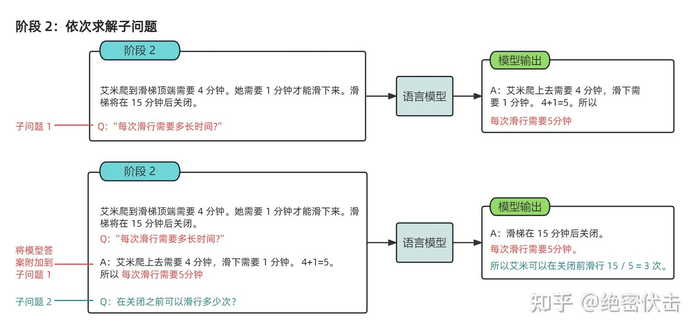
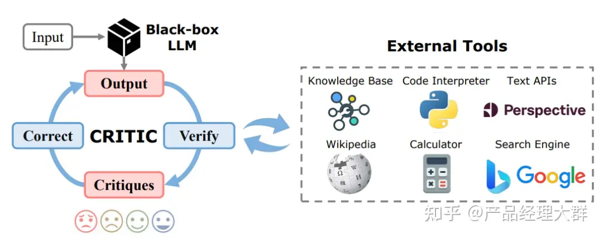

# 思维链 CoT（Chain of Thought）

## 序言
> * 对于复杂问题（尤其是复杂的数学题），大模型很难直接给出正确答案。COT通过要求/提示模型在输出最终答案之前，**显式输出中间逐步的推理步骤**这一方法来增强大模型的算数、常识和推理的性能。cot方法简单，且有效。
> * CoT 大幅度提高了 LLM 在复杂推理任务上的性能，并且**输出的中间步骤**方便使用者了解模型的思考过程，提高了大模型推理的**可解释性**。目前，思维链推理已经成为大模型处理复杂任务的一个常用手段。

## 基本概念
* 语言智能：使用基于自然语言的概念对经验事物进行 **‘理解’** 以及在概念之间进行 **‘推理’** 的能力，随着参数量的飞升，以 Transformer 为基础架构的大规模语言模型以 “Chat” 的方式逐渐向人们展现出了它的**概念理解**与**概念推理**的能力
* 推理：根据几个已知的前提推导得出新的结论的过程，作为“语言模型”的大模型具备概念理解能力并不难理解，区别于理解，推理一般是一个“多步骤”的过程，推理的过程可以形成非常必要的 **“中间概念”** ，这些中间概念将辅助复杂问题的求解。
* 涌现：在大模型领域指的是当模型突破某个规模时，性能显著提升，表现出让人惊艳、意想不到的能力。比如语言理解能力、生成能力、逻辑推理能力等。一般来说，模型在 100亿（10B） 到 1000亿（100B） 参数区间，可能产生能力涌现。

>Wei, Jason, et al. "Chain-of-Thought Prompting Elicits Reasoning in Large Language Models." arXiv (2022): n. pag. Web. https://arxiv.org/abs/2201.11903._

>"20年后入门 NLP 的人比之前的幸福，他们对 LM 的认知来自于强大的 LLM，而过去的人往往还停留在 BERT 的范式。"

## 定义

* 通过让大模型逐步参与将一个复杂问题**分解为一步一步的子问题**并依次进行求解的过程可以显著提升大模型的性能。而这一系列推理的中间步骤就被称为思维链

* 思维链（Chain of Thought）是一种提示工具，用于帮助语言模型进行复杂的推理和思考过程。它通过引导模型逐步解决问题，以一系列连贯的步骤展示推理的思路和逻辑关系。

## 作用

> 思维链提示的优势在于它提供了一个结构化的方式来指导模型进行复杂的推理任务。它帮助模型更好地理解问题的逻辑和语义，避免直接从问题到答案的简单映射，而是通过中间步骤的推理逐渐逼近最终答案。

1. **利于解决推理步骤多的问题：** 允许模型把一个复杂问题拆解成多个步骤,需要更多推理步骤的问题可以多分点计算量
2. **可debug:** 提供了一个观察模型为何会犯错的窗口，可用于debug模型
3. **可扩展：** COT能用在数学应用题、常识推理和符号操作上，即可能用在任何人类通过语言能解决的问题上；COT任何语言模型都可以用，加在 few-shot的样例中就能生效，省去了重新训练模型的功夫。

## 背景

谷歌大脑搞出GPT 生成式预训练模型中的“T”，即Transformer，但是，预训练 + 精调的大模型搞了几年，仍然没办法很好地完成多步骤推理任务，比如数学问题和常识推理。于是Jason Wei 等人提出了思维链提示的方法：

* 常识推理能力赶超人类
  
  传统语言模型在许多挑战性任务上表现不及人类，采用思维链提示的大语言模型在 BBH 评测的 23 个任务中，有 17 个超越人类基线。在常识推理（如身体与互动理解）方面有所提升；在运动理解方面，思维链模型表现优于运动爱好者（95% vs 84%）。
  
* 数学逻辑推理大幅提升
  
  传统语言模型在算术推理任务上表现较差，思维链提示显著提升大语言模型的逻辑推理能力。在 MultiArith 和 GSM8K 数据集上，PaLM 大语言模型通过思维链提示，比传统提示学习性能提升 300%。表现超越有监督学习的最优水平，证明大语言模型可解决复杂的分步骤数学计算问题。

 

   
 

* 大语言模型更具可解释性，更加可信

  超大规模无监督深度学习模型是黑盒，推理决策链不可知，影响结果可信度。思维链将逻辑推理
  问题拆解为多个步骤，逐步推导，提高结果的清晰度和逻辑性。这种方式增强了模型的可解释性，使推理过程更透明，可追溯答案的生成过程。

## 好处

* 增强了大模型的**推理能力**：
  
   * CoT 通过将复杂问题分解为多步骤的子问题，相当显著的增强了大模型的推理能力
   * 最大限度的减少了大模型忽视求解问题的“关键细节”以致于**计算资源**总是被分配于求解问题的“核心步骤”的现象；

* 增强了大模型的**可解释性**：
  
  * CoT 使得大模型通过向我们展示“做题过程”，使得我们可判断大模型在求解当前问题上如何工作
  * “做题步骤”的输出帮助定位其中错误步骤
  
* 增强了大模型的**可控性**：
  
  大模型一步一步输出步骤的呈现可以对大模型问题求解的过程施加更大的影响，避免大模型成为无法控制的“完全黑盒”；

* 增强了大模型的**灵活性**：
  
  * 仅仅添加一句“Let's think step by step”，就可以在现有的各种不同的大模型中使用 CoT 方法，
  * CoT 赋予的大模型一步一步思考的能力不仅仅局限于“语言智能”，在科学应用，以及 AI Agent 的构建之中都能用上。

 

   
 

>  论文作者在七个不同的推理任务数据集中对 CoT 的效果进行了实验，可以看到，相较于直接 Prompt， CoT 对所有的推理任务都带来了显著的提升。

## 原理

> * 思维链提示的基本思想是将推理过程分解为多个步骤，并在每个步骤中指导模型逐步进行推理。分配给更多的计算量，生成更多的 token，再把这些答案拼接在一起进行求解。每个步骤都通过自然语言描述，使模型能够理解和执行每个推理阶段所需的操作。
> 
> * 具体而言，思维链提示通常由多个中间步骤组成，每个    中间步骤都解释了问题的一个方面或子问题。模型需要根据前一个步骤的结果和当前问题的要求来推断下一个步骤。通过这种逐步推理的方式，模型可以逐渐获得更多信息，并在整个推理过程中累积正确的推断。

### 区别

* 传统的 Prompt：从输入直接到输出的映射 <input——>output> 的方式

* CoT ：从输入到思维链再到输出的映射，即 <input——>reasoning chain——>output>

### 组成

一个完整的包含 CoT 的 Prompt 往往由 **指令（Instruction），逻辑依据（Rationale），示例（Exemplars）** 三部分组成

* 指令:用于**描述**问题并且告知大模型的**输出格式**
* 逻辑依据: CoT 的**中间推理过程**，可以包含问题的**解决方案**、**中间推理步骤**以及与问题相关的任何**外部知识**
* 示例:以少样本的方式为大模型提供**输入输出对**的基本格式,包含：问题，推理过程与答案

### 分类（以是否包含示例为区分）

 

   
 

* Zero-Shot-CoT

如图，Zero-Shot-CoT 不添加示例而仅仅在指令中添加一行经典的`“Let's think step by step”`，就可以“唤醒”大模型的推理能力

> 其实 Zero-shot-CoT 是一个 pipeline。也就是说“Let's think step by step”这句话，只是通过这个 prompt 让LLM 尽可能生成一些思考过程，然后再将生成的 rationale（理由） 和 question 拼在一起，重新配合一个answer 指向的 prompt 如“The answer is ”来激励模型生成答案。
> 
> 从技术上讲，完整的零样本思维链（Zero-shot-CoT）过程涉及两个单独的提示/补全结果。在下图中，左侧生成一个思维链，而右侧接收来自第一个提示（包括第一个提示本身）的输出，并从思维链中提取答案。这个第二个提示是一个自我增强的提示。

 

   
 

“Let's think step by step”是经过验证的，比如对比下面的其它的 instruction，尤其那些不相关的和误导的，效果就非常差，说明大模型真的是在理解这句 instruction 的意思。

 

   
 

 Zero-shot-CoT 的实验效果：

 

   
 

* Few-Shot-CoT

Few-Shot-Cot 在示例中详细描述了“解题步骤”，让模型照猫画虎得到推理能力

* Auto CoT

使用零样本生成的推理链条，并结合示例选择策略，通过少样本学习的方式生成推理链条。但自动的质量一般没有人工的好，导致大模型幻觉问题严重。

### 论文中提到COT提升性能原因

* 它产生了要求求值的数学方程式，对于单步或两步问题的数据集，因为方程式可以很容易地从问题中推导出来（对于模型来说，直接将所有语义转化为单个方程是困难的，但是通过自然语言中的中间步骤，思维链可以更好地推理问题的每个部分）
* 标准的prompt让大模型直接做数学题效果不佳，证明它确实没有推理能力。思维链则在one-shot（啥是zero/few shot ）当中加入了解题的中间过程，诱导大模型“按步骤解题”，不是直接给出计算结果，这一回大模型终于推导出了正确的答案。

### 总结

* 首先，CoT 需要大模型具备一些方面“最基础”的知识，如果模型过小则会导致大模型无法理解最基本的“原子知识”，从而也无从谈起进行推理；
* 其次，使用 CoT 可以为一些它理解到的基础知识之间搭起一座桥梁，使得已知信息形成一条“链条”，从而使得大模型不会中途跑偏；
* 最后，CoT 的作用，或许在于**强迫**模型进行推理，而非教会模型如何完成推理，大模型在完成预训练后就已经具备了推理能力，而 CoT 只是向模型**指定了一种输出格式**，规范模型让模型**逐步**生成答案。（相关工作：“在程序合成领域，Nye等人（2021）利用语言模型，通过逐行预测中间计算结果来预测Python程序的最终输出，结果表明他们的逐步预测法比直接预测最终输出效果更好。”）

## 技术细节

### 论文中有关COT的实验现象（算术推理、常识推理、符号推理）

* 思维链提示对于小型模型并没有积极影响性能，**规模**较小的模型产生了流利但不合逻辑的思维链，导致性能低于标准提示。（思维链提示是模型规模的一种新兴能力--它在与足够规模的模型一起使用时才会对成绩产生积极影响）
* 对于**更复杂的问题**，思维链提示的性能收益更大。
* **扩展**能改进思维链推理能力（将PaLM扩展到540B规模可以纠正62B模型中很大一部分的缺少一步推理和语义理解错误）
* **鲁棒性：**成功使用思维链不依赖于特定的语言风格
* 思维链提示不仅使语言模型能够在标准提示设置中完成具有挑战性的**符号推理任务**，而且还促进了模型在推理时处理比少样本示例中更长的输入时的**长度泛化能力**    
* 论文强调了标准提示只是大型语言模型能力的下界，而思维链提示导致了剧烈上升的缩放曲线。思维链提示似乎扩展了大型语言模型可以成功执行的**任务范围**
* 在大多数任务中，**添加外部计算器**都能显著提高思维链提示的性能。

### 适用场景
当以下一个或多个条件不满足时，收益会较小。
* 使用大型语言模型；
* 任务具有挑战性，需要多步推理；
* 参数量的增加无法使得模型性能显著提升，缩放曲线相对平坦。  
* 训练数据**内部彼此相互联结程度**的增加可以提升 CoT 的性能；示例中的错误，或者无效的推理步骤不会导致 CoT 性能的下降；
> 《Why think step-by-step? reasoning emerges from the locality of experience》stanford 揭示了当大模型的训练数据表现出了如下图中的变量的局部簇结构（Local Clusters of Variables）时，CoT 将会展现极好的效果。而变量的局部簇主要指训练数据中变量之间有着强的相互作用，相互影响的关系。

 

   
 

* 当给予大模型的示例之间彼此之间互相区分并不相同时，也有助于提升 CoT 的性能。
* 同时，逻辑依据是否与问题相关，逻辑推理步骤的顺序也会显著影响 CoT 的性能。
* 使用代码数据训练大模型，或者使用符合 CoT 格式的数据训练模型也有助于提升 CoT 的性能。

> CoT 应当被用于 20B 以上参数规模的模型之中，并且模型的训练数据应当于任务问题相关且彼此相互有较强的联结。

### 局限性及未来方向

 

   
 

* **Prompt 模式**——主要研究“向大模型输入怎样的 Prompt 可以使得大模型获得更好的推理能力
  
  * 指令生成
    
    * 手动指令生成(“Let's think step by step”、"Plan-and-Solve逐步解决问题")
  
  >    最少到最多提示过程 LtM （Least to Most prompting）提示将思维链提示过程 (CoT prompting) 进一步发展，首先将问题分解为子问题，然后逐个解决。它是受到针对儿童的现实教育策略的启发而发展出的一种技术。
  > 
  >   与思维链提示过程类似，需要解决的问题被分解成一组建立在彼此之上的子问题。在第二步中，这些子问题被逐个解决。与思维链不同的是，先前子问题的解决方案被输入到提示中，以尝试解决下一个问题。
  >
  >context + 子问题 + 子问题解题过程 + 子问题答案 + 最终问题
   

     
   

   

     
   

    * 自动指令生成(自动 Prompt 工程（APE）以及提示优化（OPRO）)
        
        设计了一套机制让大模型通过观察各个候选的 Prompt 的实际任务中的表现，通过最大化表现得分来自动选择最优的 Prompt 

  * 范例生成
    
    * 手动范例生成(Few-Shot-CoT)
    * 介于手动范例生成与自动范例生成之间的范例生成方法——ActivePrompt 

        在 Few-Shot-CoT 的基础上，一种让大模型使用手动生成的范例多次回答问题，再从其中依据如熵、方差等的不确定性度量选择“最不确定”的问题，通过手动注释来加强范例生成

    * 自动范例生成

        i.问题聚类，对任务数据集进行聚类
        
        ii.示例采样：从每个聚类中心中选择一个代表性问题使用 Zero-Shot-CoT 生成思维链作为示例。

* **推理结构**——什么样的 Prompt 会诱导出更好的 CoT 能力以外

    * CoT 构造(主要将传统线形，链式的 CoT 转化为如表格、树状、图状格式)

        > PoT，Tab-CoT，ToT 以及 GoT-Rationale

        * PoT，P 指 Programm 即程序，PoT 的思想也非常简单，对思维链中大模型有可能出错的一些计算问题，让大模型生成出编程语言在解释器中运行，以将复杂计算与模型的文本生成解耦。

        * Tab-CoT，Tab 指 Tabular 表格，在 ToT 中，研究者迫使大模型在每一步的推理中记录一个“∣步数∣子问题∣过程∣结果∣”的**推理表格**，并让大模型在推理时从生成的表格中提取答案，从而增强大模型的推理能力。

        * ToT，T 指 Tree 即思维树，简单理解就是将 CoT 的链式结构扩展为树形结构。ToT 让大模型在解决子问题时生成多个不同的答案选择，通过此建立的树形结构让大模型可以展望未来确定下一步的决策并且通过追溯来纠正历史决策。

        * GoT，基于 ToT 的思想，将 Tree 拓展为 Graph，就形成了 GoT。GoT 系统的核心在于一个“控制器”，控制器处理对图的操作（GoO）以及图状态推理（GRS），其中 GoO 用于将一个给定的任务进行图分解，将一个任务分解为相互连接的节点-边关系，而 GRS 则负责维护大模型在 GoO 生成的图上的推理过程，记录当前步的状态，决策历史等等信息。

        * 推理聚合("解码")Self-consistency CoT，Self-consistency CoT 使用手动设计的 Prompt 生成采样一组不同的推理路径，再通过 **“多数投票”** 找到推理步骤中“最一致”的路径，使用这条解码路径驱动原始的**贪心解码方式**来提示 CoT 性能。
        
        *  CoT 验证，CoT 验证开始侧重于通过多轮提问（多数投票提高CoT性能——自洽性（Self-consistency）），让大模型进行 **“自我验证”** ，在前向后向的反复问答中让大模型可以验证自己的回答(引入“外部工具”对 CoT 中的信息进行验证，例如信息检索、计算器、计算机程序等)

            * 对多个候选的推理路径进行采样
            * 给定问题结论让大模型验证条件是否满足结论，并根据验证分数对候选结论进行排序。

     

       
     

     

       
     

     

       
     

> * 引入外部工具的 CoT 验证的代表性工作譬如 CRITIC 框架，CRITIC 使得大模型可以交互式的引入外部工具来验证与修改自己的答案输出，经过**大模型输出，外部工具验证，验证结果反馈，反馈修改**四个循环的步骤加强 CoT 输出的可靠性。
>* **任务自适应**与**流程自动化**的 AuRoRA将 CRITIC 的思想进一步推向机制，AuRoRA 从多个来源提取相关知识，将不同来源的知识进行组合、检查与提炼来修改初始 CoT，以提示 CoT 的准确性与逻辑性。

* **应用场景**——许多工作将 CoT “部署”于不同的应用场景之下以提升各种场景下大模型的能力

    > 从单语言 CoT 扩展到多语言 CoT、从单模态到多模态以及从复杂推理任务到通用推理任务的扩展

    * 多模态可以分为两类：输入多模态（MM-CoT、GoT-Input ）与输出多模态（VCoT）

      

       
     

    
    * CoT 目前也已可用于如文本摘要（SumCoT），开放域问答（Self-Prompting LLMs），机器翻译（MAPS），化学（ChemCrow）、医学（Med-PaLM）等等领域

      

       
     

    
    * CoT 与 AI Agent（CoT 赋能 Agent）

        期望通过各种AI 技术构建的 Agent 事实上是一类拥有“自主智能的实体”，可以自主的发现问题、确定目标、构想方案、选择方案、执行方案、检查更新。

        * 感知 CoT

           无论是环境的反馈，还是人类的指令，Agent 都需要完成一个对接收到的信息进行“理解”，并依据得到的理解进行意图识别，转化为下一步任务的过程 ，感知 CoT 也将加强模型自我纠错的能力。

        * 记忆 CoT
  
            一般而言，大模型智能体通常同时拥有短期记忆与长期记忆的能力。            
            
            * 当序列长度变长，线性链条式的记忆链效率出现下降时，为了实现针对“记忆”高效的增删改查，一些工作探索了树搜索与矢量检索的方法。斯坦福 25 人小镇论文中提出的反思树 Reflection Tree，当智能体面对与环境的多轮交互时，反思树可以让智能体定期抽取历史信息进行“反思”，将反思抽象得到的结果搭建构成一颗反思树，树的叶子节点代表大模型每轮的基本观察，而非叶子节点则代表反思树的抽象程度，越靠近根节点抽象程度越高。
            * 矢量检索，通过将复杂数据类型建模为矢量数据库来实现长期记忆的高效存储与检索

        * 推理 CoT

            除了感知与记忆，借鉴 CoT 的思路让智能体分解任务逐步进行计划与决策以增强智能体解决问题的可靠性。在 Agent 中，CoT 主要的功能在于将计划、行动与观察相互结合，弥合推理与行动之间的差距。（AgentBench“思考”+“行动”行动链）

### 论文中指出的局限性及未来方向

#### 局限性（“鹦鹉学舌”）

* 以往提示工作方法改进或增强了提示的输入部分（如输入前的指令），而COT则采取了正交方向，即用思维链增强语言模型的**输出**。
* 大模型是否可以真的进行可靠的 CoT 验证，在大模型的能力本身“无法解决验证结果反馈提出的问题”时，大模型有可能会**过度纠正**推理过程，直接跳过正确答案——《Can large language models really improve by selfcritiquing their own plans?》
* 思维链必须在**模型规模**足够大时才能涌现，有较高成本。思维链提示是模型规模的一种新兴能力--它在与足够规模的模型一起使用时才会对成绩产生积极影响。
* 尽管思维链模拟了人类推理者的思维过程，但这并不能回答神经网络是否实际在“推理”，这是一个悬而未决的问题（即使有思维链提示，大语言模型依然不能解决小学水平的数学问题，只是通过更精细的叠加来“照葫芦画瓢”）
* 无法保证**正确的推理路径**，这可能导致正确和不正确的答案。对于最终答案正确的数学问题，思维链推理大多是正确的，但这可能是因为自由回答问题很难通过**巧合**得出正确的最终答案。而对于对于多选或二元分类问题，模型通过错误的推理路径得出正确答案的可能性要大得多（例如我们评估的所有常识推理数据集）。

#### 未来方向（模型规模的提高，让语义理解、符号映射、连贯文本生成等能力跃升，从而让多步骤推理的思维链成为可能，带来“智能涌现”）

* 改进语言模型的**事实生成**是未来工作的一个开放方向。在语境和世界知识方面**提高语言模型生成的事实性**是语言模型研究的一个重要方向，也有望提高语言模型的多步推理能力。提高解码质量的一个潜在方法是生成多个推理路径，并用验证器对每个路径进行评分，不过这需要对验证器进行培训（Cobbe et al, 2021; Shen et al, 2021; Thoppilan et al, 2022）。
* 思维链推理仅在大型模型规模上出现，这在实际应用中具有较高的成本；进一步的研究可以探索如何在较小模型中引导推理 **（轻量化方向）**
* 思维链提示似乎扩展了大型语言模型可以成功执行的任务范围，扩大语言模型能够执行的推理任务范围，希望能够激发关于基于语言的推理方法的进一步研究。（思维链的应用领域是有限的，如只在数学问题，五个常识推理基准上显现出作用。其他任务如机器翻译，性能提升效果还有待评估。）
* 思维链的收益并没有在不同模型之间完美转移，这是一个限制因素；进一步的工作可以研究**为什么不同的预训练数据集和模型架构**会影响思维链提示的性能提升。
* 作为模型规模的结果，思维链推理的成功是一个复杂的现象，可能涉及各种新出现的能力（语义理解、符号映射、保持主题、算术能力、忠实性等）。未来的工作可以更深入地研究预训练数据、模型架构和优化目标的**哪些属性**能够促成这种推理能力。
* 如何以**稳健的方式生成思维链注释**可能是未来工作的一个有趣方向。例如，一个想法是使用大型语言模型通过提示自动生成思维链（并在验证集上优化）。