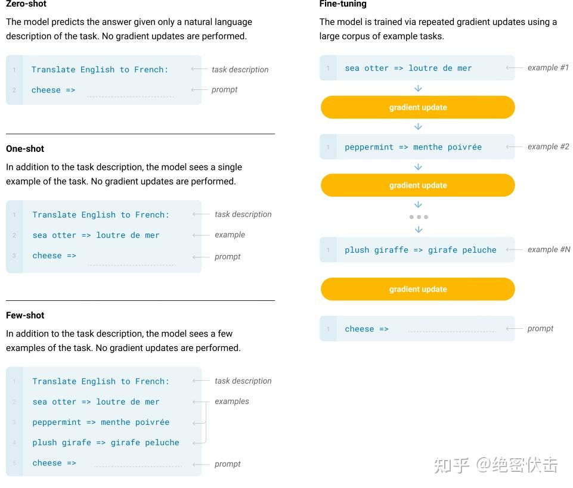

## **Scaling Transformers** 

**Scaling Transformers** （扩展 Transformer）指的是在 Transformer 模型中对规模进行扩展的技术或策略，目的是提高模型处理更大数据集或更复杂任务的能力。这一扩展通常会包括增加模型的参数数量、增大计算资源、提高训练效率等方面的优化。Transformer 模型自从被提出以来，凭借其出色的表现，在自然语言处理（NLP）和其他领域取得了巨大的成功。然而，随着数据集和任务的规模增大，传统的 Transformer 模型面临着计算和存储方面的瓶颈。因此，研究者们提出了多种 **Scaling Transformers**  的方法来解决这些问题，并使其能够扩展到更大规模的任务。
### Scaling Transformers 的几个重要方向： 
 
1. **增加模型的深度和宽度** ： 
  - **深度** ：通过增加 Transformer 模型的层数（即增大网络的深度），使得模型能够更好地学习到复杂的模式和表示。例如，GPT-3 就是通过增加层数和参数来实现更强大的表现。
 
  - **宽度** ：通过增加每一层中的隐藏单元数，使得模型能够更好地表示信息，处理更复杂的任务。
 
2. **稀疏化技术** ： 
  - 扩展 Transformer 时，计算量会呈二次增长（$$O(N^2)$$，其中 $$N$$ 是输入序列长度）。为了应对长序列，稀疏化技术（例如空洞注意力或稀疏因式分解）被提出，它通过减少计算量，保留重要信息，使得模型能够处理更长的序列，同时减小计算成本。
 
3. **分布式训练** ：
  - 随着模型参数的增大，训练 Transformer 所需的计算资源也大幅增加。因此，分布式训练成为了扩展 Transformer 的重要方法之一。通过将模型训练过程分布到多个计算节点上，利用并行计算和分布式存储，可以加速训练过程。
 
4. **混合精度训练** ：
  - 为了提高训练效率，混合精度训练（Mixed-Precision Training）被广泛应用。通过使用较低精度（例如 FP16）进行计算，可以减少计算资源的消耗，从而提高训练速度，特别是在大规模模型和数据集上。
 
5. **模型压缩和蒸馏** ： 
  - **知识蒸馏** （Knowledge Distillation）是一种通过训练一个小模型来模仿大模型的技术。它可以使得较大的 Transformer 模型在不损失太多性能的情况下被压缩成更小、更高效的模型，便于在实际应用中部署。
 
6. **自动化模型架构搜索（NAS）** ：
  - 为了找到最适合特定任务的 Transformer 架构，自动化模型架构搜索（NAS）技术被提出。NAS 通过搜索和优化 Transformer 模型的架构（例如层数、宽度、注意力头数等），使得模型能够在给定资源下达到最佳表现。

### 具体应用： 
 
1. **GPT-3（Generative Pre-trained Transformer 3）** ： 
  - GPT-3 是一个典型的 **Scaling Transformer** ，它通过大规模的预训练和极大的模型参数（1750亿参数）实现了令人惊叹的语言生成能力。GPT-3 的成功展示了大规模 Transformer 在各种 NLP 任务中的潜力。
 
2. **BERT**  和 **T5** ：
  - 这些 Transformer 模型通过大规模的数据集和深度的网络结构进行预训练，经过扩展后可以用于各种任务，包括问答、文本分类和文本生成等。
 
3. **Vision Transformer (ViT)** ：
  - Vision Transformer 是一种将 Transformer 应用于计算机视觉任务的方法，ViT 在对图像数据进行建模时，采用了类似于 NLP 中的 Transformer 架构，成功地通过扩展 Transformer 解决了图像分类等问题。

### 总结： 
**Scaling Transformers**  主要是指通过扩展模型规模、使用先进的技术和优化策略，来提升 Transformer 模型的处理能力。无论是在自然语言处理、计算机视觉，还是其他领域，Scaling Transformers 的目标是使模型能够有效处理大规模数据和更复杂的任务，从而实现更强大的性能。

---

https://arxiv.org/pdf/2005.14165.pdf
如何使用 prompt learning 提升大模型的推理能力

 ## **Zero-shot、One-shot、Few-shot 三种不同的 prompt 方法**

 

 * Few-Shot（FS）是指模型在推理时给予少量样本，但不允许进行权重更新。对于一个典型数据集，Few-shot 有上下文和样例（例如英语句子和它的法语翻译）。Few-shot 的工作方式是提供 K 个样本，然后期望模型生成对应的结果。通常将 K 设置在 10 到 100 的范围内，因为这是可以适应模型上下文窗口的示例数量（nctx = 2048）。Few-shot 的主要优点是大幅度降低了对特定任务数据的需求，并减少了从微调数据集中学习过度狭窄分布。主要缺点是该方法的结果迄今为止远不如最先进的微调模型。此外，仍需要一小部分特定任务的数据。
* One-Shot（1S）与 Few-Shot 类似，只允许一个样本（除了任务的自然语言描述外）。将 One-Shot 与 Few-Shot、Zero-Shot 区分开的原因是它最接近某些任务与人类沟通的方式。相比之下，如果没有示例，有时很难传达任务的内容或格式。
* Zero-Shot（0S）和 One-shot 类似，但不允许提供样本，只给出描述任务的自然语言指令。该方法提供了最大的方便性、稳健性以及避免虚假相关的可能性，但也是最具挑战性的设置。在某些情况下，即使是人类，在没有例子的情况下，也可能难以理解任务的格式。例如，如果要求某人“制作一张关于200米冲刺世界纪录的表格”，这个请求可能是模棱两可的，因为可能不清楚表格应该具有什么格式或包含什么内容。然而，至少在某些情况下，Zero-shot 是最接近人类执行任务的方法，例如图 1 中的翻译示例，人类可能仅凭文本指令就知道该做什么。

但是，即使是 Few-Shot，这种方法还是有比较大的缺陷的。如果你的问题相对简单，不需要什么逻辑推理，可能靠大模型背答案就能做得不错，但是对于一些需要推理的问题，都不用太难，就一些简单的算术应用题，大模型就大概率不太 work。于是，思维链（Chain-of-Thought，CoT）很自然地被提出了。

---

## 微调是啥？